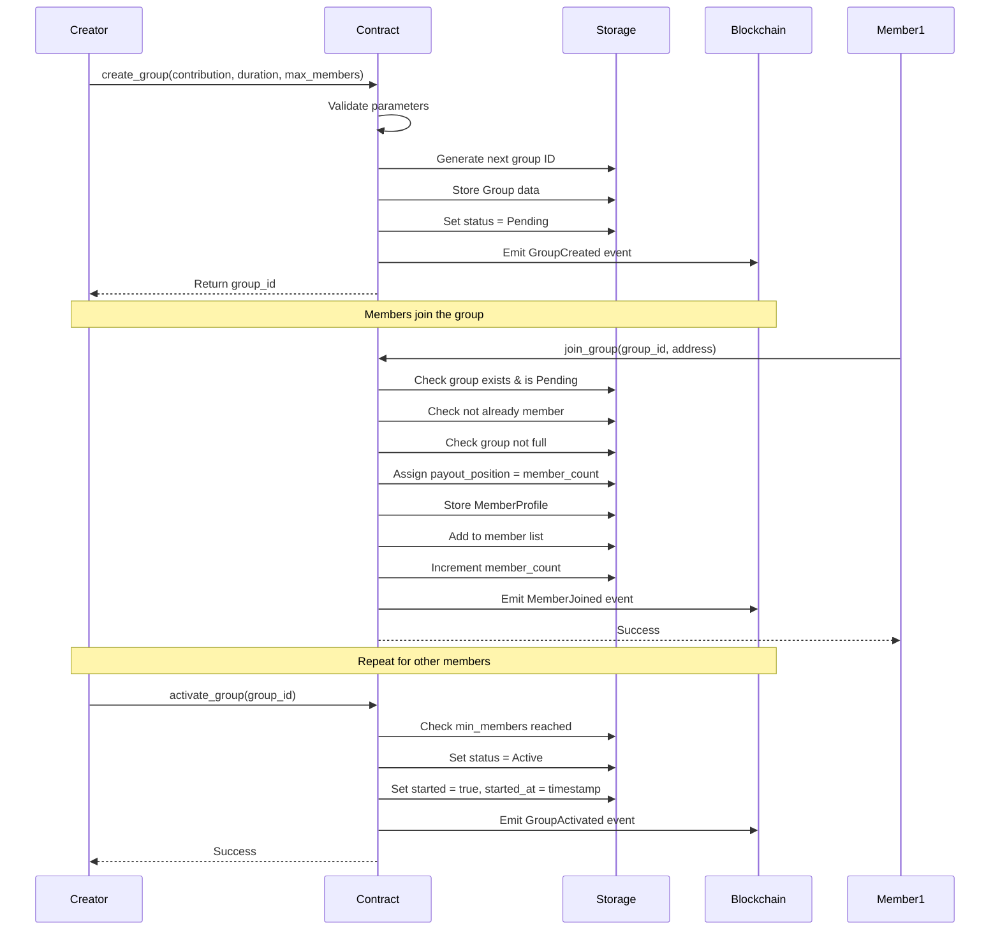
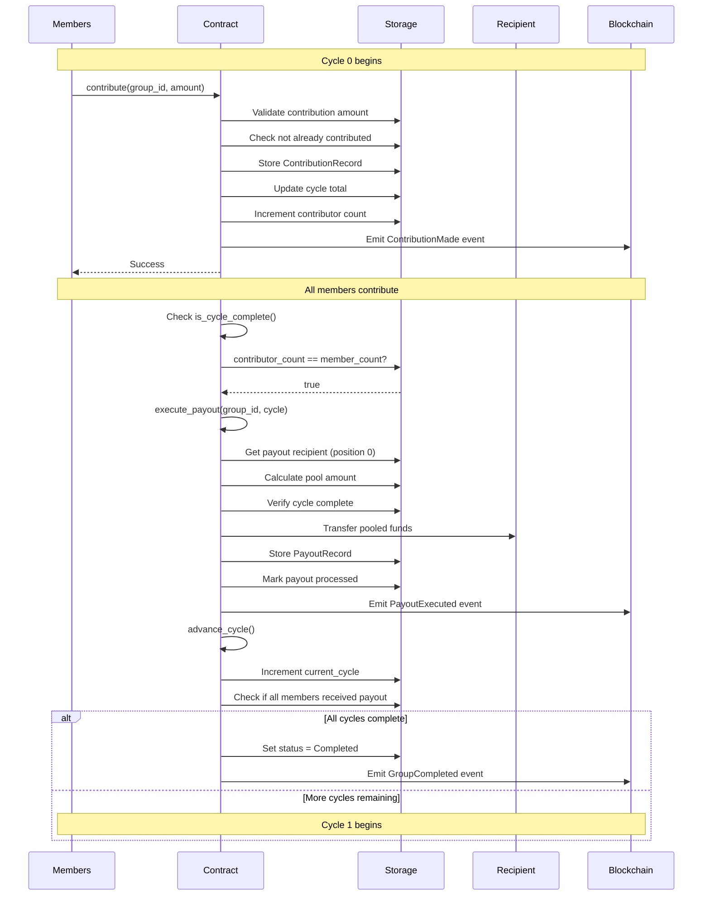
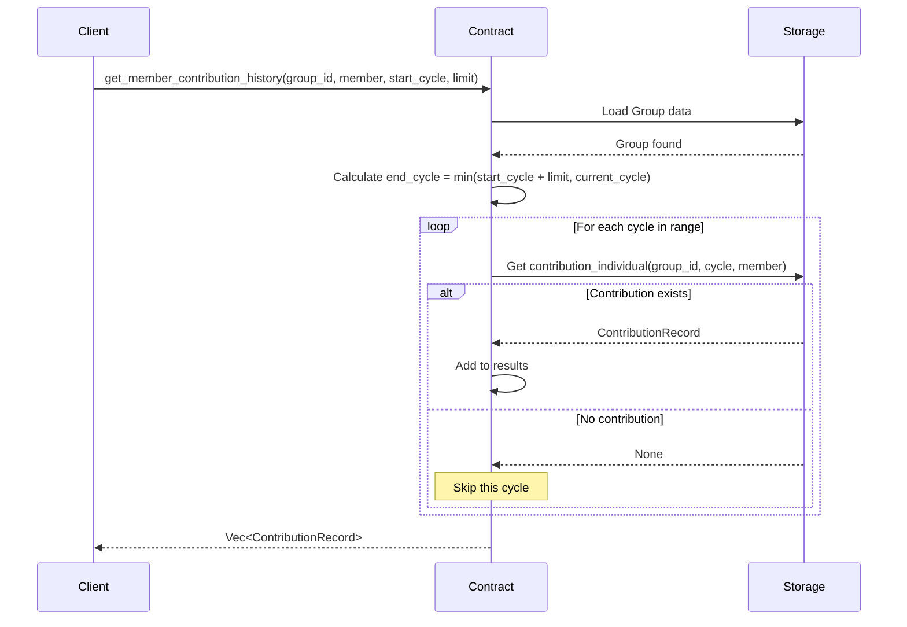
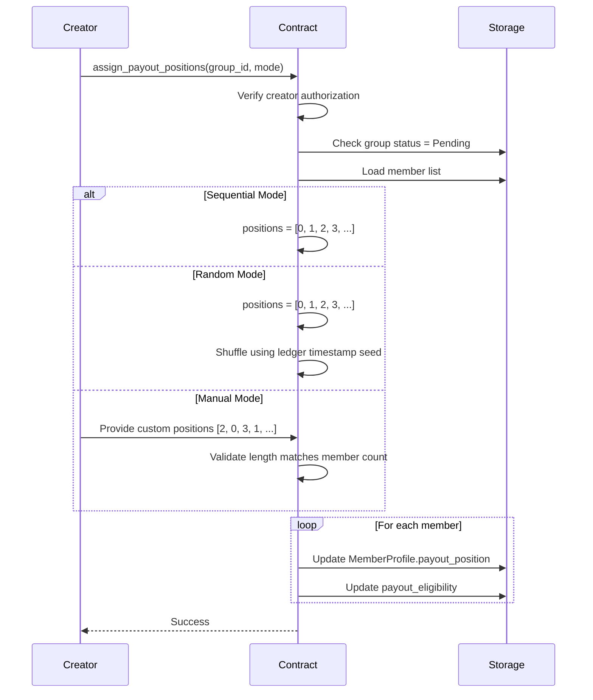
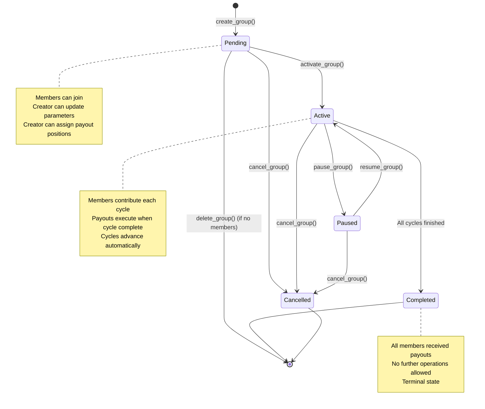
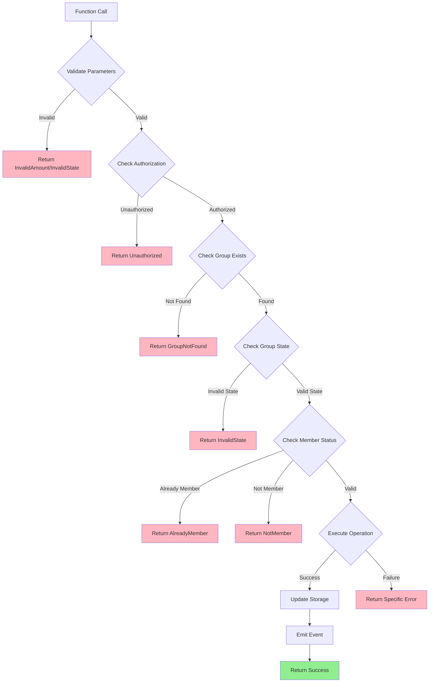

# Stellar-Save Smart Contract API Reference

**Version:** 1.0.0  
**Contract:** StellarSaveContract  
**Platform:** Stellar Soroban

## Table of Contents

1. [Overview](#overview)
2. [Data Types](#data-types)
3. [Error Codes](#error-codes)
4. [Group Management](#group-management)
5. [Member Operations](#member-operations)
6. [Contribution Tracking](#contribution-tracking)
7. [Query Functions](#query-functions)
8. [Configuration](#configuration)
9. [Sequence Diagrams](#sequence-diagrams)

---

## Overview

The Stellar-Save smart contract implements a decentralized Rotating Savings and Credit Association (ROSCA) on the Stellar blockchain. This API reference documents all public functions, their parameters, return types, and usage examples.

### Key Concepts

- **Group**: A ROSCA savings group with fixed contribution amounts and cycle duration
- **Cycle**: A time period during which all members contribute
- **Payout**: Distribution of pooled funds to a designated member
- **Payout Position**: Member's turn order for receiving payouts (0-indexed)

### Contract Address

Deploy the contract and note the contract ID for invocation:
```bash
stellar contract deploy --wasm target/wasm32-unknown-unknown/release/stellar_save.wasm --network testnet
```

---

## Data Types

### Group

Represents a savings group configuration and state.

```rust
pub struct Group {
    pub id: u64,                      // Unique group identifier
    pub creator: Address,             // Group creator's address
    pub contribution_amount: i128,    // Required contribution per cycle (stroops)
    pub cycle_duration: u64,          // Cycle length in seconds
    pub max_members: u32,             // Maximum allowed members
    pub min_members: u32,             // Minimum required members to activate
    pub member_count: u32,            // Current number of members
    pub current_cycle: u32,           // Current cycle number (0-indexed)
    pub is_active: bool,              // Whether group is active
    pub status: GroupStatus,          // Current group status
    pub created_at: u64,              // Creation timestamp
    pub started: bool,                // Whether group has started cycles
    pub started_at: u64,              // Timestamp when group started
}
```

### GroupStatus

Lifecycle states of a savings group.

```rust
pub enum GroupStatus {
    Pending,      // Created, waiting for members
    Active,       // Running cycles, accepting contributions
    Paused,       // Temporarily suspended
    Completed,    // All cycles finished
    Cancelled,    // Permanently terminated
}
```

### MemberProfile

Member information within a group.

```rust
pub struct MemberProfile {
    pub address: Address,         // Member's address
    pub group_id: u64,            // Associated group ID
    pub payout_position: u32,     // Turn order for payout (0-indexed)
    pub joined_at: u64,           // Join timestamp
}
```

### ContributionRecord

Tracks individual member contributions.

```rust
pub struct ContributionRecord {
    pub member_address: Address,  // Contributing member
    pub group_id: u64,            // Associated group
    pub cycle_number: u32,        // Cycle of contribution
    pub amount: i128,             // Contribution amount (stroops)
    pub timestamp: u64,           // Contribution timestamp
}
```

### PayoutRecord

Tracks payout distributions.

```rust
pub struct PayoutRecord {
    pub recipient: Address,       // Payout recipient
    pub group_id: u64,            // Associated group
    pub cycle_number: u32,        // Cycle of payout
    pub amount: i128,             // Payout amount (stroops)
    pub timestamp: u64,           // Payout timestamp
}
```

### AssignmentMode

Payout position assignment strategies.

```rust
pub enum AssignmentMode {
    Sequential,              // Join order (default)
    Random,                  // Random shuffle using ledger timestamp
    Manual(Vec<u32>),        // Explicit position assignment
}
```

### ContractConfig

Global contract configuration.

```rust
pub struct ContractConfig {
    pub admin: Address,              // Contract administrator
    pub min_contribution: i128,      // Minimum contribution amount
    pub max_contribution: i128,      // Maximum contribution amount
    pub min_members: u32,            // Minimum group size
    pub max_members: u32,            // Maximum group size
    pub min_cycle_duration: u64,     // Minimum cycle length
    pub max_cycle_duration: u64,     // Maximum cycle length
}
```

---

## Error Codes

All errors return `StellarSaveError` with specific error codes.

### Group Errors (1000-1999)

| Code | Error | Description |
|------|-------|-------------|
| 1001 | `GroupNotFound` | The specified group ID does not exist |
| 1002 | `GroupFull` | Group has reached maximum member capacity |
| 1003 | `InvalidState` | Group is not in valid state for operation |

### Member Errors (2000-2999)

| Code | Error | Description |
|------|-------|-------------|
| 2001 | `AlreadyMember` | Address is already a member of the group |
| 2002 | `NotMember` | Address is not a member of the group |
| 2003 | `Unauthorized` | Caller is not authorized for this operation |

### Contribution Errors (3000-3999)

| Code | Error | Description |
|------|-------|-------------|
| 3001 | `InvalidAmount` | Contribution amount is invalid or incorrect |
| 3002 | `AlreadyContributed` | Member already contributed for current cycle |
| 3003 | `CycleNotComplete` | Current cycle missing contributions |
| 3004 | `ContributionNotFound` | Contribution record not found |

### Payout Errors (4000-4999)

| Code | Error | Description |
|------|-------|-------------|
| 4001 | `PayoutFailed` | Payout operation failed |
| 4002 | `PayoutAlreadyProcessed` | Payout already processed for cycle |
| 4003 | `InvalidRecipient` | Recipient not eligible for payout |

### System Errors (9000-9999)

| Code | Error | Description |
|------|-------|-------------|
| 9001 | `InternalError` | Internal contract error occurred |
| 9002 | `DataCorruption` | Contract data is corrupted |
| 9003 | `Overflow` | Arithmetic overflow or counter limit reached |

---

## Group Management

### create_group

Creates a new savings group.

**Signature:**
```rust
pub fn create_group(
    env: Env,
    creator: Address,
    contribution_amount: i128,
    cycle_duration: u64,
    max_members: u32,
) -> Result<u64, StellarSaveError>
```

**Parameters:**
- `env`: Soroban environment
- `creator`: Address of the group creator (requires authorization)
- `contribution_amount`: Fixed contribution per member per cycle (stroops, 1 XLM = 10^7 stroops)
- `cycle_duration`: Length of each cycle in seconds
- `max_members`: Maximum number of members allowed

**Returns:**
- `Ok(u64)`: Unique group ID
- `Err(StellarSaveError)`: Error if validation fails

**Errors:**
- `InvalidState`: Parameters violate global configuration limits

**Example:**
```rust
// Create a group: 10 XLM per cycle, 7-day cycles, max 5 members
let group_id = contract.create_group(
    env,
    creator_address,
    100_000_000,  // 10 XLM in stroops
    604_800,      // 7 days in seconds
    5             // max 5 members
)?;
```

**CLI Example:**
```bash
stellar contract invoke \
  --id CONTRACT_ID \
  --network testnet \
  -- create_group \
  --creator CREATOR_ADDRESS \
  --contribution_amount 100000000 \
  --cycle_duration 604800 \
  --max_members 5
```

---

### update_group

Updates group parameters. Only allowed for creators while group is in Pending state.

**Signature:**
```rust
pub fn update_group(
    env: Env,
    group_id: u64,
    new_contribution: i128,
    new_duration: u64,
    new_max_members: u32,
) -> Result<(), StellarSaveError>
```

**Parameters:**
- `env`: Soroban environment
- `group_id`: ID of the group to update
- `new_contribution`: New contribution amount (stroops)
- `new_duration`: New cycle duration (seconds)
- `new_max_members`: New maximum member count

**Returns:**
- `Ok(())`: Group successfully updated
- `Err(StellarSaveError)`: Error if validation fails

**Errors:**
- `GroupNotFound`: Group doesn't exist
- `Unauthorized`: Caller is not the group creator
- `InvalidState`: Group is not in Pending state or parameters invalid

**Example:**
```rust
// Update group to 15 XLM per cycle
contract.update_group(
    env,
    group_id,
    150_000_000,  // 15 XLM
    604_800,      // Keep 7-day cycles
    5             // Keep max 5 members
)?;
```

---

### get_group

Retrieves group details.

**Signature:**
```rust
pub fn get_group(
    env: Env,
    group_id: u64
) -> Result<Group, StellarSaveError>
```

**Parameters:**
- `env`: Soroban environment
- `group_id`: ID of the group to retrieve

**Returns:**
- `Ok(Group)`: Group data structure
- `Err(StellarSaveError::GroupNotFound)`: Group doesn't exist

**Example:**
```rust
let group = contract.get_group(env, 1)?;
println!("Contribution: {} stroops", group.contribution_amount);
println!("Members: {}/{}", group.member_count, group.max_members);
println!("Current cycle: {}", group.current_cycle);
```

---

### delete_group

Deletes a group. Only allowed if no members have joined.

**Signature:**
```rust
pub fn delete_group(
    env: Env,
    group_id: u64
) -> Result<(), StellarSaveError>
```

**Parameters:**
- `env`: Soroban environment
- `group_id`: ID of the group to delete

**Returns:**
- `Ok(())`: Group successfully deleted
- `Err(StellarSaveError)`: Error if validation fails

**Errors:**
- `GroupNotFound`: Group doesn't exist
- `Unauthorized`: Caller is not the group creator
- `InvalidState`: Group has members (cannot delete)

**Example:**
```rust
// Delete an empty group
contract.delete_group(env, group_id)?;
```

---

### list_groups

Lists groups with pagination and optional status filtering.

**Signature:**
```rust
pub fn list_groups(
    env: Env,
    cursor: u64,
    limit: u32,
    status_filter: Option<GroupStatus>,
) -> Result<Vec<Group>, StellarSaveError>
```

**Parameters:**
- `env`: Soroban environment
- `cursor`: Starting group ID for pagination (0 = start from latest)
- `limit`: Maximum number of groups to return (capped at 50)
- `status_filter`: Optional status filter (None = all groups)

**Returns:**
- `Ok(Vec<Group>)`: Vector of group data
- `Err(StellarSaveError)`: Error if operation fails

**Example:**
```rust
// Get first 10 active groups
let groups = contract.list_groups(
    env,
    0,                              // Start from latest
    10,                             // Limit to 10
    Some(GroupStatus::Active)       // Only active groups
)?;

// Get next page
let next_groups = contract.list_groups(
    env,
    groups.last().unwrap().id,      // Continue from last ID
    10,
    Some(GroupStatus::Active)
)?;
```

---

### get_total_groups

Returns the total number of groups created.

**Signature:**
```rust
pub fn get_total_groups(env: Env) -> u64
```

**Parameters:**
- `env`: Soroban environment

**Returns:**
- `u64`: Total number of groups created

**Example:**
```rust
let total = contract.get_total_groups(env);
println!("Total groups created: {}", total);
```

---

### activate_group

Activates a group to start the first cycle. Only callable by creator when minimum members reached.

**Signature:**
```rust
pub fn activate_group(
    env: Env,
    group_id: u64,
    creator: Address,
    member_count: u32
)
```

**Parameters:**
- `env`: Soroban environment
- `group_id`: ID of the group to activate
- `creator`: Creator's address (must match group creator)
- `member_count`: Current member count (must meet minimum)

**Panics:**
- If caller is not the group creator
- If group has already been started
- If minimum member count not reached

**Example:**
```rust
// Activate group once minimum members joined
contract.activate_group(env, group_id, creator_address, 3);
```

## Member Operations

### join_group

Allows a user to join an existing savings group.

**Signature:**
```rust
pub fn join_group(
    env: Env,
    group_id: u64,
    member: Address,
) -> Result<(), StellarSaveError>
```

**Parameters:**
- `env`: Soroban environment
- `group_id`: ID of the group to join
- `member`: Address of the joining member (requires authorization)

**Returns:**
- `Ok(())`: Member successfully joined
- `Err(StellarSaveError)`: Error if validation fails

**Errors:**
- `GroupNotFound`: Group doesn't exist
- `AlreadyMember`: User is already a member
- `GroupFull`: Group has reached maximum capacity
- `InvalidState`: Group is not in Pending state (not joinable)

**Example:**
```rust
// Join group 1
contract.join_group(env, 1, member_address)?;
```

**CLI Example:**
```bash
stellar contract invoke \
  --id CONTRACT_ID \
  --network testnet \
  -- join_group \
  --group_id 1 \
  --member MEMBER_ADDRESS
```

**Notes:**
- Members can only join groups in Pending status
- Payout position is assigned based on join order (0-indexed)
- Member profile is stored with join timestamp

---

### get_member_count

Returns the number of members in a group.

**Signature:**
```rust
pub fn get_member_count(
    env: Env,
    group_id: u64
) -> Result<u32, StellarSaveError>
```

**Parameters:**
- `env`: Soroban environment
- `group_id`: ID of the group

**Returns:**
- `Ok(u32)`: Number of members in the group
- `Err(StellarSaveError::GroupNotFound)`: Group doesn't exist

**Example:**
```rust
let count = contract.get_member_count(env, 1)?;
println!("Group has {} members", count);
```

---

### get_payout_position

Returns a member's payout position in the rotation.

**Signature:**
```rust
pub fn get_payout_position(
    env: Env,
    group_id: u64,
    member_address: Address,
) -> Result<u32, StellarSaveError>
```

**Parameters:**
- `env`: Soroban environment
- `group_id`: ID of the group
- `member_address`: Address of the member

**Returns:**
- `Ok(u32)`: Payout position (0-indexed)
- `Err(StellarSaveError)`: Error if member not found

**Errors:**
- `NotMember`: Address is not a member of the group

**Example:**
```rust
let position = contract.get_payout_position(env, 1, member_address)?;
println!("Member receives payout in cycle {}", position);
```

**Notes:**
- Position 0 receives payout in cycle 0
- Position 1 receives payout in cycle 1, etc.
- Positions are assigned when members join

---

### assign_payout_positions

Assigns or reassigns payout positions to members. Only callable by group creator while in Pending state.

**Signature:**
```rust
pub fn assign_payout_positions(
    env: Env,
    group_id: u64,
    caller: Address,
    mode: AssignmentMode,
) -> Result<(), StellarSaveError>
```

**Parameters:**
- `env`: Soroban environment
- `group_id`: ID of the group
- `caller`: Address of the caller (must be group creator)
- `mode`: Assignment strategy (Sequential, Random, or Manual)

**Returns:**
- `Ok(())`: Positions successfully assigned
- `Err(StellarSaveError)`: Error if validation fails

**Errors:**
- `GroupNotFound`: Group doesn't exist
- `Unauthorized`: Caller is not the group creator
- `InvalidState`: Group is not in Pending state or manual positions invalid

**Example:**
```rust
// Sequential assignment (default)
contract.assign_payout_positions(
    env,
    group_id,
    creator_address,
    AssignmentMode::Sequential
)?;

// Random assignment
contract.assign_payout_positions(
    env,
    group_id,
    creator_address,
    AssignmentMode::Random
)?;

// Manual assignment
let positions = vec![env, 2, 0, 3, 1]; // Custom order
contract.assign_payout_positions(
    env,
    group_id,
    creator_address,
    AssignmentMode::Manual(positions)
)?;
```

---

### has_received_payout

Checks if a member has already received their payout.

**Signature:**
```rust
pub fn has_received_payout(
    env: Env,
    group_id: u64,
    member_address: Address,
) -> Result<bool, StellarSaveError>
```

**Parameters:**
- `env`: Soroban environment
- `group_id`: ID of the group
- `member_address`: Address of the member

**Returns:**
- `Ok(bool)`: true if member received payout, false otherwise
- `Err(StellarSaveError::GroupNotFound)`: Group doesn't exist

**Example:**
```rust
let received = contract.has_received_payout(env, 1, member_address)?;
if received {
    println!("Member has already received their payout");
}
```

**Notes:**
- In a ROSCA, each member receives exactly one payout
- Checks all cycles from 0 to current_cycle

---

## Contribution Tracking

### validate_contribution_amount

Validates that a contribution amount matches the group's required amount.

**Signature:**
```rust
pub fn validate_contribution_amount(
    env: &Env,
    group_id: u64,
    amount: i128,
) -> Result<(), StellarSaveError>
```

**Parameters:**
- `env`: Soroban environment
- `group_id`: ID of the group
- `amount`: Contribution amount to validate (stroops)

**Returns:**
- `Ok(())`: Amount is valid
- `Err(StellarSaveError)`: Error if validation fails

**Errors:**
- `GroupNotFound`: Group doesn't exist
- `InvalidAmount`: Amount doesn't match group requirement

**Example:**
```rust
// Validate 10 XLM contribution for group 1
contract.validate_contribution_amount(&env, 1, 100_000_000)?;
```

---

### get_member_total_contributions

Gets the total amount contributed by a member across all cycles.

**Signature:**
```rust
pub fn get_member_total_contributions(
    env: Env,
    group_id: u64,
    member: Address,
) -> Result<i128, StellarSaveError>
```

**Parameters:**
- `env`: Soroban environment
- `group_id`: ID of the group
- `member`: Address of the member

**Returns:**
- `Ok(i128)`: Total contribution amount (stroops)
- `Err(StellarSaveError)`: Error if operation fails

**Errors:**
- `GroupNotFound`: Group doesn't exist
- `Overflow`: Arithmetic overflow in calculation

**Example:**
```rust
let total = contract.get_member_total_contributions(env, 1, member_address)?;
println!("Member has contributed {} stroops total", total);
```

---

### get_member_contribution_history

Gets contribution history for a member with pagination.

**Signature:**
```rust
pub fn get_member_contribution_history(
    env: Env,
    group_id: u64,
    member: Address,
    start_cycle: u32,
    limit: u32,
) -> Result<Vec<ContributionRecord>, StellarSaveError>
```

**Parameters:**
- `env`: Soroban environment
- `group_id`: ID of the group
- `member`: Address of the member
- `start_cycle`: Starting cycle number (inclusive)
- `limit`: Maximum records to return (capped at 50)

**Returns:**
- `Ok(Vec<ContributionRecord>)`: Vector of contribution records
- `Err(StellarSaveError::GroupNotFound)`: Group doesn't exist

**Example:**
```rust
// Get first 10 contributions
let history = contract.get_member_contribution_history(
    env,
    1,
    member_address,
    0,   // Start from cycle 0
    10   // Limit to 10 records
)?;

for record in history.iter() {
    println!("Cycle {}: {} stroops at {}",
        record.cycle_number,
        record.amount,
        record.timestamp
    );
}
```

---

### get_cycle_contributions

Gets all contributions for a specific cycle.

**Signature:**
```rust
pub fn get_cycle_contributions(
    env: Env,
    group_id: u64,
    cycle_number: u32,
) -> Result<Vec<ContributionRecord>, StellarSaveError>
```

**Parameters:**
- `env`: Soroban environment
- `group_id`: ID of the group
- `cycle_number`: Cycle number to query

**Returns:**
- `Ok(Vec<ContributionRecord>)`: Vector of all contributions in the cycle
- `Err(StellarSaveError::GroupNotFound)`: Group doesn't exist

**Example:**
```rust
// Get all contributions for cycle 0
let contributions = contract.get_cycle_contributions(env, 1, 0)?;
println!("{} members contributed in cycle 0", contributions.len());
```

**Notes:**
- Only returns contributions that exist (members who contributed)
- Does not include members who skipped the cycle

---

### is_cycle_complete

Checks if all members have contributed for a cycle.

**Signature:**
```rust
pub fn is_cycle_complete(
    env: Env,
    group_id: u64,
    cycle_number: u32,
) -> Result<bool, StellarSaveError>
```

**Parameters:**
- `env`: Soroban environment
- `group_id`: ID of the group
- `cycle_number`: Cycle number to check

**Returns:**
- `Ok(bool)`: true if all members contributed, false otherwise
- `Err(StellarSaveError::GroupNotFound)`: Group doesn't exist

**Example:**
```rust
let complete = contract.is_cycle_complete(env, 1, 0)?;
if complete {
    println!("Cycle 0 is complete, ready for payout");
}
```

---

### get_missed_contributions

Identifies members who haven't contributed in a cycle.

**Signature:**
```rust
pub fn get_missed_contributions(
    env: Env,
    group_id: u64,
    cycle_number: u32,
) -> Result<Vec<Address>, StellarSaveError>
```

**Parameters:**
- `env`: Soroban environment
- `group_id`: ID of the group
- `cycle_number`: Cycle number to check

**Returns:**
- `Ok(Vec<Address>)`: Vector of addresses who haven't contributed
- `Err(StellarSaveError::GroupNotFound)`: Group doesn't exist

**Example:**
```rust
let missed = contract.get_missed_contributions(env, 1, 0)?;
if !missed.is_empty() {
    println!("{} members haven't contributed yet", missed.len());
    for member in missed.iter() {
        println!("Reminder needed for: {}", member);
    }
}
```

**Use Cases:**
- Tracking delinquent members
- Sending contribution reminders
- Determining cycle completion status

---

### get_contribution_deadline

Calculates the deadline timestamp for contributions in a cycle.

**Signature:**
```rust
pub fn get_contribution_deadline(
    env: Env,
    group_id: u64,
    cycle_number: u32,
) -> Result<u64, StellarSaveError>
```

**Parameters:**
- `env`: Soroban environment
- `group_id`: ID of the group
- `cycle_number`: Cycle number

**Returns:**
- `Ok(u64)`: Unix timestamp when cycle deadline expires
- `Err(StellarSaveError)`: Error if operation fails

**Errors:**
- `GroupNotFound`: Group doesn't exist
- `InvalidState`: Group hasn't been started yet
- `Overflow`: Timestamp calculation overflow

**Example:**
```rust
let deadline = contract.get_contribution_deadline(env, 1, 0)?;
let current_time = env.ledger().timestamp();

if current_time > deadline {
    println!("Cycle 0 has expired");
} else {
    let remaining = deadline - current_time;
    println!("{} seconds remaining to contribute", remaining);
}
```

**Calculation:**
```
deadline = started_at + (cycle_number * cycle_duration) + cycle_duration
```

---

## Query Functions

### get_total_groups_created

Returns the total number of groups created (same as get_total_groups).

**Signature:**
```rust
pub fn get_total_groups_created(env: Env) -> u64
```

**Parameters:**
- `env`: Soroban environment

**Returns:**
- `u64`: Total number of groups created

**Example:**
```rust
let total = contract.get_total_groups_created(env);
```

---

## Configuration

### update_config

Initializes or updates the global contract configuration. Only callable by admin.

**Signature:**
```rust
pub fn update_config(
    env: Env,
    new_config: ContractConfig
) -> Result<(), StellarSaveError>
```

**Parameters:**
- `env`: Soroban environment
- `new_config`: New configuration settings

**Returns:**
- `Ok(())`: Configuration successfully updated
- `Err(StellarSaveError::InvalidState)`: Configuration validation failed

**Errors:**
- `InvalidState`: Configuration values are invalid

**Example:**
```rust
let config = ContractConfig {
    admin: admin_address,
    min_contribution: 10_000_000,      // 1 XLM minimum
    max_contribution: 1_000_000_000,   // 100 XLM maximum
    min_members: 2,
    max_members: 20,
    min_cycle_duration: 86_400,        // 1 day minimum
    max_cycle_duration: 2_592_000,     // 30 days maximum
};

contract.update_config(env, config)?;
```

**Validation Rules:**
- `min_contribution > 0`
- `max_contribution >= min_contribution`
- `min_members >= 2`
- `max_members >= min_members`
- `min_cycle_duration > 0`
- `max_cycle_duration >= min_cycle_duration`

**Notes:**
- First call sets the admin (caller becomes admin)
- Subsequent calls require admin authorization
- All new groups must comply with these limits

---

## Sequence Diagrams

### Group Creation and Member Joining Flow



---

### Contribution and Payout Cycle Flow



---

### Member Contribution History Query Flow



---

### Payout Position Assignment Flow



---

### Group Lifecycle State Transitions



---

### Error Handling Flow



---

## Usage Examples

### Complete ROSCA Lifecycle Example

```rust
use stellar_save::{StellarSaveContract, GroupStatus, AssignmentMode};

// 1. Create a group
let group_id = contract.create_group(
    env.clone(),
    creator.clone(),
    100_000_000,  // 10 XLM per cycle
    604_800,      // 7-day cycles
    5             // Max 5 members
)?;

// 2. Members join
contract.join_group(env.clone(), group_id, member1.clone())?;
contract.join_group(env.clone(), group_id, member2.clone())?;
contract.join_group(env.clone(), group_id, member3.clone())?;

// 3. Creator assigns payout positions (optional - defaults to join order)
contract.assign_payout_positions(
    env.clone(),
    group_id,
    creator.clone(),
    AssignmentMode::Random
)?;

// 4. Activate group
contract.activate_group(env.clone(), group_id, creator.clone(), 3);

// 5. Members contribute in cycle 0
contract.contribute(env.clone(), group_id, member1.clone(), 100_000_000)?;
contract.contribute(env.clone(), group_id, member2.clone(), 100_000_000)?;
contract.contribute(env.clone(), group_id, member3.clone(), 100_000_000)?;

// 6. Check cycle completion
let complete = contract.is_cycle_complete(env.clone(), group_id, 0)?;
assert!(complete);

// 7. Execute payout (automatic when cycle complete)
// Recipient determined by payout_position 0
contract.execute_payout(env.clone(), group_id, 0)?;

// 8. Cycle advances automatically
let group = contract.get_group(env.clone(), group_id)?;
assert_eq!(group.current_cycle, 1);

// 9. Repeat contributions for remaining cycles...

// 10. Check group completion
let group = contract.get_group(env.clone(), group_id)?;
if group.status == GroupStatus::Completed {
    println!("All members have received their payouts!");
}
```

---

### Query Member Statistics Example

```rust
// Get member's total contributions
let total = contract.get_member_total_contributions(
    env.clone(),
    group_id,
    member_address.clone()
)?;
println!("Total contributed: {} stroops", total);

// Get contribution history
let history = contract.get_member_contribution_history(
    env.clone(),
    group_id,
    member_address.clone(),
    0,   // Start from cycle 0
    10   // Get up to 10 records
)?;

for record in history.iter() {
    println!("Cycle {}: {} stroops on {}",
        record.cycle_number,
        record.amount,
        record.timestamp
    );
}

// Check if member received payout
let received = contract.has_received_payout(
    env.clone(),
    group_id,
    member_address.clone()
)?;

// Get payout position
let position = contract.get_payout_position(
    env.clone(),
    group_id,
    member_address.clone()
)?;
println!("Member receives payout in cycle {}", position);
```

---

### Admin Configuration Example

```rust
use stellar_save::ContractConfig;

// Initialize contract configuration
let config = ContractConfig {
    admin: admin_address.clone(),
    min_contribution: 10_000_000,      // 1 XLM minimum
    max_contribution: 1_000_000_000,   // 100 XLM maximum
    min_members: 2,                    // At least 2 members
    max_members: 50,                   // Up to 50 members
    min_cycle_duration: 86_400,        // 1 day minimum
    max_cycle_duration: 2_592_000,     // 30 days maximum
};

contract.update_config(env.clone(), config)?;

// All new groups must comply with these limits
let group_id = contract.create_group(
    env.clone(),
    creator.clone(),
    50_000_000,   // 5 XLM - within limits
    604_800,      // 7 days - within limits
    10            // 10 members - within limits
)?;
```

---

### Pagination Example

```rust
// List all active groups with pagination
let mut all_groups = Vec::new();
let mut cursor = 0;
let page_size = 10;

loop {
    let groups = contract.list_groups(
        env.clone(),
        cursor,
        page_size,
        Some(GroupStatus::Active)
    )?;
    
    if groups.is_empty() {
        break;
    }
    
    for group in groups.iter() {
        all_groups.push(group.clone());
        cursor = group.id;
    }
    
    if groups.len() < page_size as usize {
        break;
    }
}

println!("Found {} active groups", all_groups.len());
```

---

## CLI Usage Examples

### Create and Join a Group

```bash
# 1. Create a group
GROUP_ID=$(stellar contract invoke \
  --id $CONTRACT_ID \
  --network testnet \
  -- create_group \
  --creator $CREATOR_ADDRESS \
  --contribution_amount 100000000 \
  --cycle_duration 604800 \
  --max_members 5)

echo "Created group: $GROUP_ID"

# 2. Join the group
stellar contract invoke \
  --id $CONTRACT_ID \
  --network testnet \
  -- join_group \
  --group_id $GROUP_ID \
  --member $MEMBER1_ADDRESS

# 3. Get group details
stellar contract invoke \
  --id $CONTRACT_ID \
  --network testnet \
  -- get_group \
  --group_id $GROUP_ID
```

---

### Query Contribution Status

```bash
# Check if cycle is complete
stellar contract invoke \
  --id $CONTRACT_ID \
  --network testnet \
  -- is_cycle_complete \
  --group_id 1 \
  --cycle_number 0

# Get missed contributions
stellar contract invoke \
  --id $CONTRACT_ID \
  --network testnet \
  -- get_missed_contributions \
  --group_id 1 \
  --cycle_number 0

# Get contribution deadline
stellar contract invoke \
  --id $CONTRACT_ID \
  --network testnet \
  -- get_contribution_deadline \
  --group_id 1 \
  --cycle_number 0
```

---

## Best Practices

### For Group Creators

1. **Set Realistic Parameters**: Choose contribution amounts and cycle durations that members can commit to
2. **Communicate Clearly**: Ensure all members understand the ROSCA mechanics before joining
3. **Assign Positions Fairly**: Use Random mode for fairness or Manual mode for specific arrangements
4. **Activate Promptly**: Activate the group once minimum members join to start cycles

### For Members

1. **Contribute On Time**: Contribute before the cycle deadline to avoid delays
2. **Track Your Position**: Know when you'll receive your payout using `get_payout_position`
3. **Monitor Progress**: Check cycle completion status regularly
4. **Verify Amounts**: Always validate contribution amounts match group requirements

### For Developers

1. **Handle Errors Gracefully**: Check error codes and provide user-friendly messages
2. **Use Pagination**: Always paginate when querying lists to avoid gas limits
3. **Cache Group Data**: Cache group details to reduce contract calls
4. **Monitor Events**: Subscribe to contract events for real-time updates
5. **Test Thoroughly**: Test all edge cases including cycle boundaries and state transitions

---

## Gas Optimization Tips

1. **Batch Queries**: Use pagination with appropriate limits (10-50 items)
2. **Cache Static Data**: Store group configuration locally after first fetch
3. **Minimize Storage Reads**: Use query functions that return aggregated data
4. **Event Monitoring**: Listen to events instead of polling for state changes

---

## Security Considerations

1. **Authorization**: All state-changing functions require proper authorization
2. **Amount Validation**: Contribution amounts are strictly validated
3. **State Checks**: Operations only allowed in valid group states
4. **Overflow Protection**: All arithmetic operations check for overflow
5. **Immutable Records**: Contribution and payout records cannot be modified

---

## Version History

### v1.0.0 (Current)
- Initial release with core ROSCA functionality
- XLM native support
- Group creation and management
- Member joining and payout position assignment
- Contribution tracking and validation
- Cycle completion and payout execution
- Comprehensive query functions
- Admin configuration

### Planned Features (v1.1+)
- Custom token support (USDC, EURC, etc.)
- Flexible payout schedules
- Penalty mechanisms for missed contributions
- Group pause/resume functionality
- Member removal before activation
- Contribution deadlines enforcement

---

## Support and Resources

- **Documentation**: [https://github.com/Xoulomon/Stellar-Save/tree/main/docs](https://github.com/Xoulomon/Stellar-Save/tree/main/docs)
- **Issues**: [https://github.com/Xoulomon/Stellar-Save/issues](https://github.com/Xoulomon/Stellar-Save/issues)
- **Discussions**: [https://github.com/Xoulomon/Stellar-Save/discussions](https://github.com/Xoulomon/Stellar-Save/discussions)
- **Stellar Docs**: [https://developers.stellar.org/docs](https://developers.stellar.org/docs)
- **Soroban Docs**: [https://soroban.stellar.org/docs](https://soroban.stellar.org/docs)

---

## License

This project is licensed under the MIT License. See [LICENSE](../LICENSE) for details.

---

**Last Updated**: 2026-02-24  
**Contract Version**: 1.0.0  
**Soroban SDK**: 23.0.3
