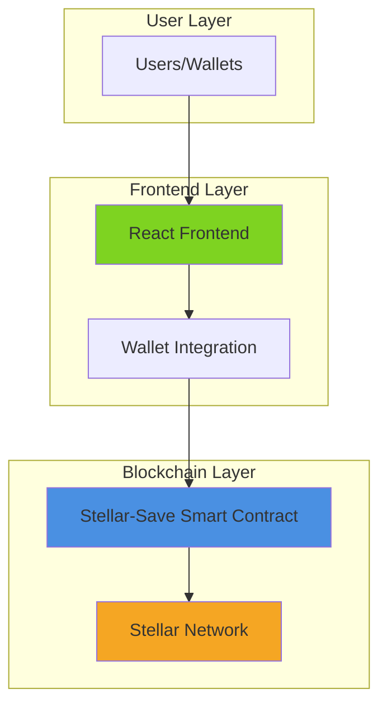
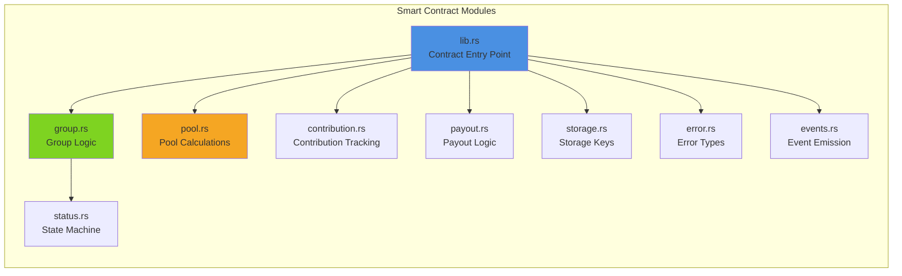
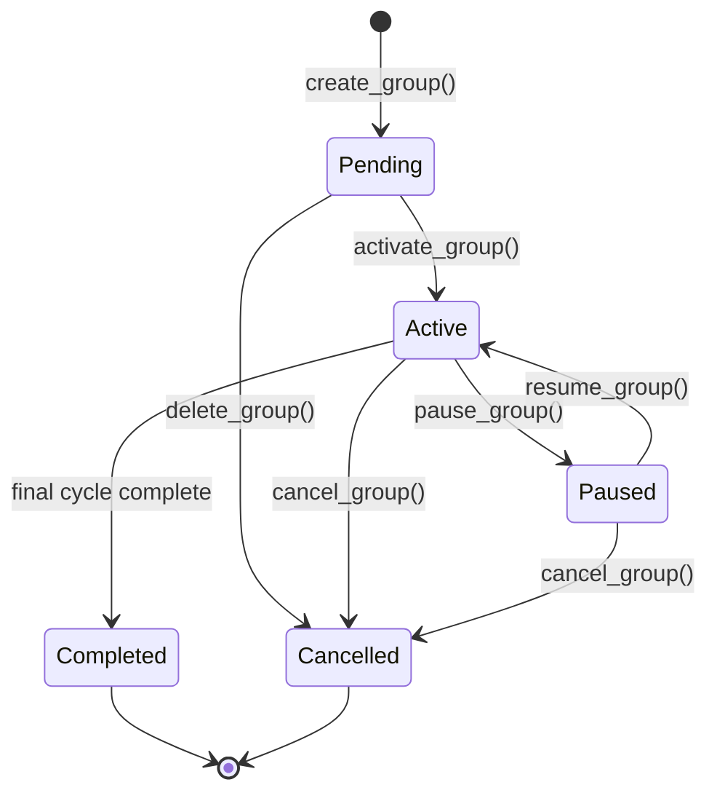
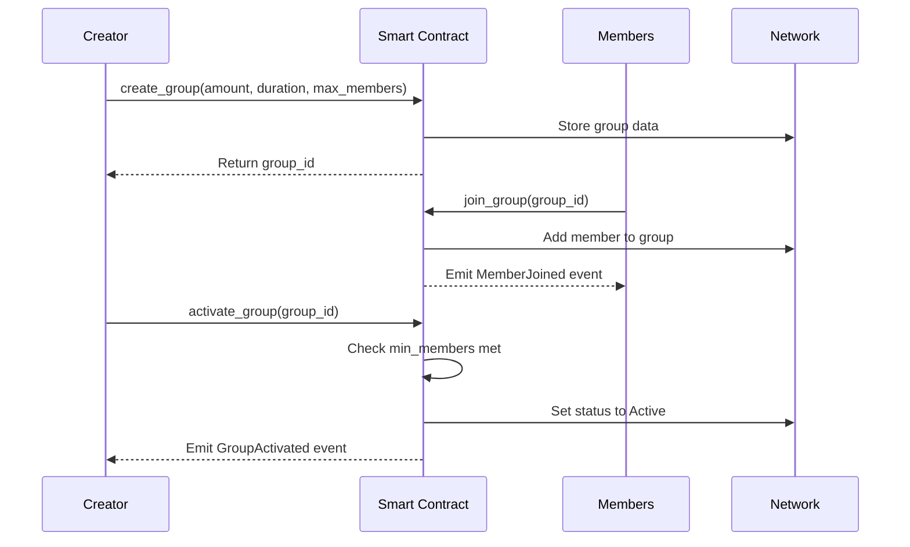
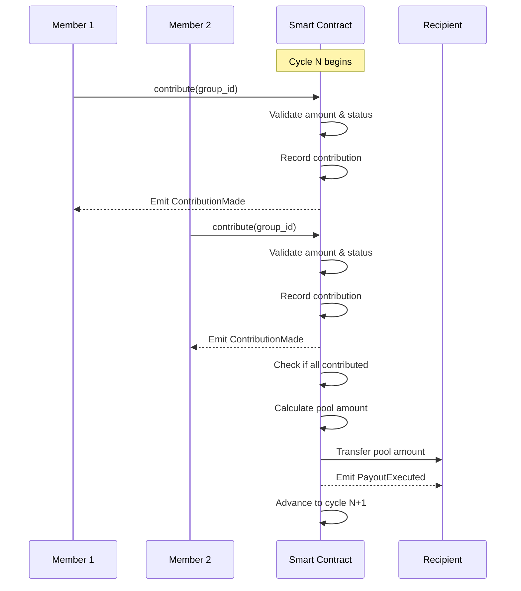
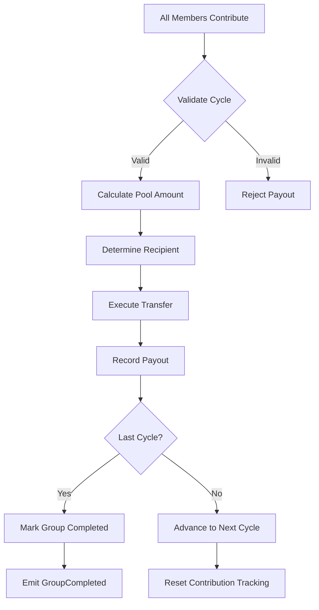
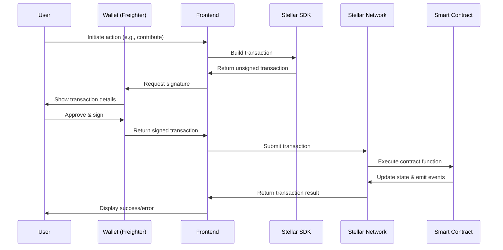
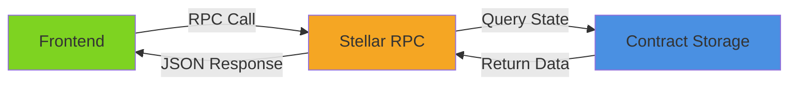
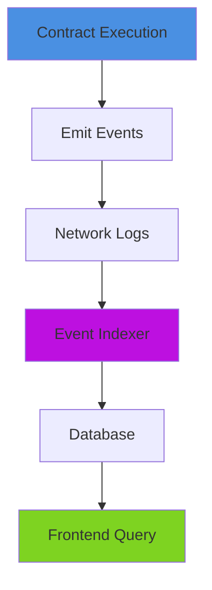
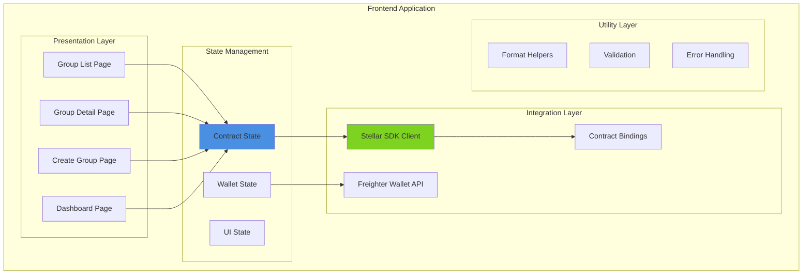

# Stellar-Save Architecture Documentation

## Table of Contents
1. [System Overview](#system-overview)
2. [Architecture Layers](#architecture-layers)
3. [Smart Contract Architecture](#smart-contract-architecture)
4. [ROSCA Mechanics Implementation](#rosca-mechanics-implementation)
5. [State Management](#state-management)
6. [Data Flow](#data-flow)
7. [Frontend Architecture](#frontend-architecture)
8. [Security & Invariants](#security--invariants)

---

## System Overview

Stellar-Save is a decentralized rotational savings and credit association (ROSCA) platform built on Stellar's Soroban smart contract platform. The system enables groups of users to pool funds in rotating cycles, where each member contributes a fixed amount and receives the total pool on their designated turn.

### Core Components



### Technology Stack

- **Smart Contracts**: Rust + Soroban SDK v23.0.3
- **Blockchain**: Stellar (Testnet/Mainnet)
- **Frontend**: React 18.3 + TypeScript + Vite
- **Wallet Integration**: Freighter API v6.0.1
- **SDK**: Stellar SDK v14.5.0

---

## Architecture Layers

### Layer 1: Smart Contract Core
The smart contract layer implements all business logic, state management, and ROSCA mechanics on-chain.

### Layer 2: Blockchain Network
Stellar network provides transaction execution, consensus, and state persistence.

### Layer 3: Frontend Application
React-based UI for user interaction, wallet connection, and transaction submission.

---

## Smart Contract Architecture

### Module Structure



### Component Responsibilities

#### lib.rs - Contract Entry Point
- Public contract interface (`#[contractimpl]`)
- Group creation and management
- Configuration management
- ID generation and counters
- Authorization checks

**Key Functions:**
- `create_group()` - Creates new ROSCA group
- `update_group()` - Modifies group parameters (Pending state only)
- `delete_group()` - Removes group (no members only)
- `get_group()` - Retrieves group data
- `list_groups()` - Paginated group listing with filtering
- `activate_group()` - Starts first cycle
- `update_config()` - Admin configuration updates

#### group.rs - Group Logic
- Group data structure definition
- Lifecycle management
- Validation logic
- Member counting
- Cycle advancement

**Group Structure:**
```rust
pub struct Group {
    pub id: u64,
    pub creator: Address,
    pub contribution_amount: i128,  // stroops
    pub cycle_duration: u64,        // seconds
    pub max_members: u32,
    pub min_members: u32,
    pub member_count: u32,
    pub current_cycle: u32,
    pub is_active: bool,
    pub status: GroupStatus,
    pub created_at: u64,
    pub started: bool,
    pub started_at: u64,
}
```

**Key Methods:**
- `new()` - Creates validated group instance
- `activate()` - Starts group when min members reached
- `advance_cycle()` - Moves to next cycle after payout
- `complete()` - Marks group as completed
- `validate()` - Checks group configuration validity

#### pool.rs - Pool Calculations
- Pool amount calculations
- Cycle completion tracking
- Contribution aggregation
- Payout validation

**Formula:**
```
Total Pool = Contribution Amount × Member Count
```

**PoolInfo Structure:**
```rust
pub struct PoolInfo {
    pub group_id: u64,
    pub cycle: u32,
    pub member_count: u32,
    pub contribution_amount: i128,
    pub total_pool_amount: i128,
    pub current_contributions: i128,
    pub contributors_count: u32,
    pub is_cycle_complete: bool,
}
```

#### status.rs - State Machine
- Group lifecycle states
- State transition validation
- Terminal state handling

**State Diagram:**


**Valid Transitions:**
- Pending → Active, Cancelled
- Active → Paused, Completed, Cancelled
- Paused → Active, Cancelled
- Completed → (terminal)
- Cancelled → (terminal)

#### storage.rs - Storage Keys
- Hierarchical key structure
- Efficient data access patterns
- Storage key builders

**Key Categories:**
```rust
pub enum StorageKey {
    Group(GroupKey),           // Group data
    Member(MemberKey),         // Member profiles
    Contribution(ContributionKey), // Contribution records
    Payout(PayoutKey),         // Payout records
    Counter(CounterKey),       // Global counters
}
```

#### error.rs - Error Handling
- Comprehensive error types
- Error categorization
- Error codes (stable across versions)

**Error Categories:**
- 1000-1999: Group errors
- 2000-2999: Member errors
- 3000-3999: Contribution errors
- 4000-4999: Payout errors
- 9000-9999: System errors

#### events.rs - Event Emission
- Event definitions
- Event emission utilities
- On-chain event logging

**Event Types:**
- `GroupCreated` - New group created
- `MemberJoined` - Member joins group
- `ContributionMade` - Member contributes
- `PayoutExecuted` - Payout distributed
- `GroupCompleted` - All cycles finished
- `GroupStatusChanged` - Status transition

---

## ROSCA Mechanics Implementation

### Participant Lifecycle



### Contribution Cycle



### Payout Logic

**Payout Eligibility:**
1. Group must be in Active status
2. All members must have contributed for current cycle
3. Total contributions must equal expected pool amount
4. Recipient must be a valid member
5. Payout must not have been processed for this cycle

**Payout Calculation:**
```rust
// Each member receives the full pool once
payout_amount = contribution_amount × member_count

// Example: 5 members × 10 XLM = 50 XLM payout
```

**Payout Order:**
- Determined by join order or predefined rotation
- Each member receives exactly one payout
- Group completes after all members receive payout

### Consensus Mechanism

**No External Oracle Required:**
- All logic executed on-chain
- Deterministic state transitions
- Consensus provided by Stellar network
- No off-chain data dependencies

**Trust Model:**
- Trustless: No central coordinator
- Transparent: All transactions on-chain
- Programmable: Automated payout execution
- Verifiable: Public transaction history

### Settlement Flow



---

## State Management

### Contract State Structure

**Persistent Storage:**
```rust
// Group data
GROUP_{id} → Group
GROUP_MEMBERS_{id} → Vec<Address>
GROUP_STATUS_{id} → GroupStatus

// Member data
MEMBER_{group_id}_{address} → MemberProfile
MEMBER_CONTRIB_{group_id}_{address} → bool
MEMBER_PAYOUT_{group_id}_{address} → PayoutEligibility

// Contribution tracking
CONTRIB_{group_id}_{cycle}_{address} → ContributionRecord
CONTRIB_TOTAL_{group_id}_{cycle} → i128
CONTRIB_COUNT_{group_id}_{cycle} → u32

// Payout records
PAYOUT_{group_id}_{cycle} → PayoutRecord
PAYOUT_RECIPIENT_{group_id}_{cycle} → Address
PAYOUT_STATUS_{group_id}_{cycle} → bool

// Global counters
COUNTER_GROUP_ID → u64
COUNTER_TOTAL_GROUPS → u64
COUNTER_ACTIVE_GROUPS → u64
```

### State Transitions

**Group Lifecycle:**
1. **Creation** (Pending)
   - Creator calls `create_group()`
   - Group ID generated atomically
   - Initial state: Pending, member_count=0

2. **Member Joining** (Pending/Active)
   - Members call `join_group()`
   - Member count incremented
   - Member address stored

3. **Activation** (Pending → Active)
   - Creator calls `activate_group()`
   - Requires: member_count ≥ min_members
   - Sets started=true, started_at=timestamp

4. **Contribution Phase** (Active)
   - Members call `contribute()`
   - Contribution recorded per member per cycle
   - Cycle total and count updated

5. **Payout Phase** (Active)
   - Automatic when cycle complete
   - Pool transferred to recipient
   - Payout record created

6. **Cycle Advancement** (Active)
   - current_cycle incremented
   - Contribution tracking reset
   - Next recipient determined

7. **Completion** (Active → Completed)
   - Triggered when current_cycle ≥ max_members
   - Status set to Completed
   - is_active set to false
   - Terminal state reached

### Invariants

**Critical Invariants:**
1. `member_count ≤ max_members` (always)
2. `min_members ≤ max_members` (always)
3. `current_cycle ≤ max_members` (always)
4. `contribution_amount > 0` (always)
5. `cycle_duration > 0` (always)
6. Each member contributes exactly once per cycle
7. Each member receives exactly one payout
8. Total contributions = pool amount before payout
9. Group ID is unique and monotonically increasing
10. Terminal states (Completed, Cancelled) cannot transition

**Enforcement:**
- Validation in `Group::new()`
- Runtime checks in state transition functions
- Overflow protection with `checked_add()`, `checked_mul()`
- Authorization checks with `require_auth()`

---

## Data Flow

### Transaction Submission Flow



### Read-Only Calls



**Read Operations:**
- `get_group(group_id)` - Fetch group details
- `list_groups(cursor, limit, filter)` - Paginated group list
- `get_total_groups()` - Total group count
- Pool info queries (via PoolCalculator)

**No Gas Cost:**
- Read-only calls don't modify state
- No transaction fees
- Instant response

### Event Indexing

**Event Flow:**


**Event Types Emitted:**
- GroupCreated
- MemberJoined
- ContributionMade
- PayoutExecuted
- GroupCompleted
- GroupStatusChanged

**Frontend Integration:**
- Subscribe to contract events
- Filter by event type and group_id
- Update UI reactively
- Maintain local event cache

### Authentication

**Wallet-Based Authentication:**
```rust
// Contract-level authorization
creator.require_auth();  // Stellar SDK built-in

// Validates:
// 1. Transaction signed by creator's private key
// 2. Signature matches creator's public key
// 3. Transaction not replayed (sequence number)
```

**No Separate Auth Layer:**
- Authentication = transaction signature
- Authorization = contract logic checks
- Identity = Stellar address

### Error Handling Patterns

**Contract Errors:**
```rust
pub enum StellarSaveError {
    GroupNotFound = 1001,
    GroupFull = 1002,
    InvalidState = 1003,
    AlreadyMember = 2001,
    NotMember = 2002,
    Unauthorized = 2003,
    InvalidAmount = 3001,
    AlreadyContributed = 3002,
    CycleNotComplete = 3003,
    PayoutFailed = 4001,
    // ...
}
```

**Frontend Error Handling:**
```typescript
try {
  const result = await contract.contribute({ group_id });
  // Handle success
} catch (error) {
  if (error.code === 3002) {
    // Already contributed this cycle
    showError("You've already contributed this cycle");
  } else if (error.code === 1003) {
    // Invalid state
    showError("Group is not accepting contributions");
  }
  // ...
}
```

---

## Frontend Architecture

### Current State

The frontend is currently a minimal React + Vite boilerplate. The architecture below describes the planned implementation.

### Planned Architecture



### State Management Approach

**Planned Strategy:**
1. **React Context** for global state (wallet, network)
2. **React Query** for contract data fetching & caching
3. **Local State** for UI-specific state

**Data Fetching:**
```typescript
// Example: Fetch group data
const useGroup = (groupId: string) => {
  return useQuery({
    queryKey: ['group', groupId],
    queryFn: async () => {
      const contract = new StellarSaveContract(contractId);
      return await contract.get_group({ group_id: groupId });
    },
    staleTime: 30000, // 30 seconds
  });
};
```

**Data Synchronization:**
- Poll contract state at regular intervals
- Subscribe to contract events for real-time updates
- Optimistic UI updates with rollback on error
- Cache invalidation on successful transactions

**Event Subscription:**
```typescript
// Subscribe to group events
const subscribeToGroupEvents = (groupId: string) => {
  const eventStream = stellar.events.subscribe({
    contractId,
    filter: { group_id: groupId },
  });
  
  eventStream.on('ContributionMade', (event) => {
    // Update local cache
    queryClient.invalidateQueries(['group', groupId]);
  });
  
  eventStream.on('PayoutExecuted', (event) => {
    // Show notification
    showNotification('Payout executed!');
    queryClient.invalidateQueries(['group', groupId]);
  });
};
```

### Technology Choices

**Dependencies:**
- `@stellar/stellar-sdk` - Stellar blockchain interaction
- `@stellar/freighter-api` - Wallet connection
- `react-query` (planned) - Data fetching & caching
- `react-router` (planned) - Navigation
- `zustand` or `jotai` (planned) - Lightweight state management

---

## Security & Invariants

### Security Considerations

**1. Overflow Protection**
```rust
// All arithmetic uses checked operations
let next_id = current_id.checked_add(1)
    .ok_or(StellarSaveError::Overflow)?;

let pool_amount = contribution_amount
    .checked_mul(member_count as i128)
    .ok_or(StellarSaveError::InternalError)?;
```

**2. Authorization Checks**
```rust
// Only creator can update group
group.creator.require_auth();

// Only members can contribute
member.require_auth();
```

**3. State Validation**
```rust
// Validate state transitions
if !status.can_transition_to(new_status) {
    return Err(StellarSaveError::InvalidState);
}

// Validate group configuration
if !group.validate() {
    return Err(StellarSaveError::InvalidState);
}
```

**4. Input Validation**
```rust
// Validate contribution amount
if contribution_amount <= 0 {
    return Err(StellarSaveError::InvalidAmount);
}

// Validate member count
if member_count == 0 {
    return Err(StellarSaveError::InvalidState);
}
```

**5. Reentrancy Protection**
- Soroban's execution model prevents reentrancy
- State updates before external calls
- No recursive contract calls

### Invariant Maintenance

**Group Invariants:**
```rust
impl Group {
    pub fn validate(&self) -> bool {
        self.contribution_amount > 0
            && self.cycle_duration > 0
            && self.max_members >= 2
            && self.min_members >= 2
            && self.min_members <= self.max_members
            && self.current_cycle <= self.max_members
    }
}
```

**Cycle Invariants:**
- Each member contributes exactly once per cycle
- Payout only when all members contributed
- Total contributions = expected pool amount

**Payout Invariants:**
- Each member receives exactly one payout
- Payout amount = contribution_amount × member_count
- Payout only in Active status

### Testing Strategy

**Unit Tests:**
- 24+ tests in pool.rs
- 20+ tests in group.rs
- 15+ tests in status.rs
- 10+ tests in error.rs
- 10+ tests in storage.rs

**Integration Tests:**
- Full lifecycle tests
- Multi-member scenarios
- Error condition tests
- State transition tests

**Test Coverage:**
```bash
cargo test --lib
# Expected: 80+ tests passing
```

---

## Deployment Architecture

### Network Configuration

**Testnet:**
- RPC: `https://soroban-testnet.stellar.org`
- Network Passphrase: `Test SDF Network ; September 2015`
- Purpose: Development and testing

**Mainnet:**
- RPC: `https://soroban-mainnet.stellar.org`
- Network Passphrase: `Public Global Stellar Network ; September 2015`
- Purpose: Production deployment

### Contract Deployment

```bash
# Build contract
soroban contract build

# Deploy to testnet
soroban contract deploy \
  --wasm target/wasm32-unknown-unknown/release/stellar_save.wasm \
  --network testnet

# Initialize configuration
soroban contract invoke \
  --id <CONTRACT_ID> \
  --network testnet \
  -- update_config \
  --new_config '{"admin":"<ADMIN_ADDRESS>","min_contribution":1000000,...}'
```

### Monitoring & Observability

**Contract Events:**
- All state changes emit events
- Events indexed by Stellar Horizon
- Frontend subscribes to relevant events

**Metrics to Monitor:**
- Total groups created
- Active groups count
- Total contributions processed
- Total payouts executed
- Error rates by type

---

## Future Enhancements

### Planned Features

1. **Custom Token Support**
   - Support for USDC, EURC, and other Stellar assets
   - Multi-currency groups

2. **Flexible Payout Schedules**
   - Random selection
   - Bidding mechanism
   - Priority-based distribution

3. **Penalty Mechanisms**
   - Late contribution penalties
   - Missed contribution handling
   - Collateral requirements

4. **Advanced Frontend**
   - Mobile-responsive UI
   - Real-time notifications
   - Group analytics dashboard
   - Member reputation system

5. **Governance**
   - Group voting mechanisms
   - Parameter adjustment proposals
   - Dispute resolution

---

## Conclusion

Stellar-Save implements a trustless, transparent ROSCA system on Stellar blockchain. The architecture emphasizes:

- **Security**: Comprehensive validation and overflow protection
- **Transparency**: All operations on-chain with event emission
- **Efficiency**: Optimized storage and calculation patterns
- **Maintainability**: Clear module separation and extensive testing
- **Extensibility**: Modular design for future enhancements

The system is production-ready for XLM-based groups and provides a solid foundation for future feature development.

---

## References

- [Stellar Soroban Documentation](https://soroban.stellar.org/)
- [Stellar SDK Documentation](https://stellar.github.io/js-stellar-sdk/)
- [Project README](../README.md)
- [Pool Calculation Documentation](../POOL_CALCULATION.md)
- [Environment Setup](./ENVIRONMENT_SETUP.md)
