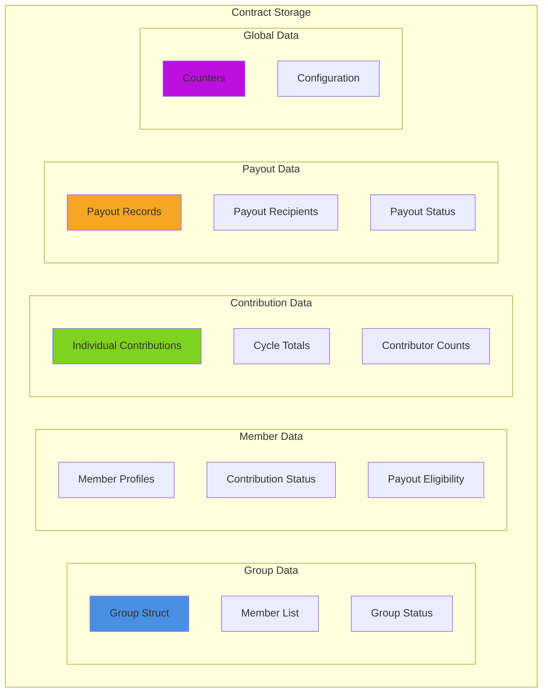
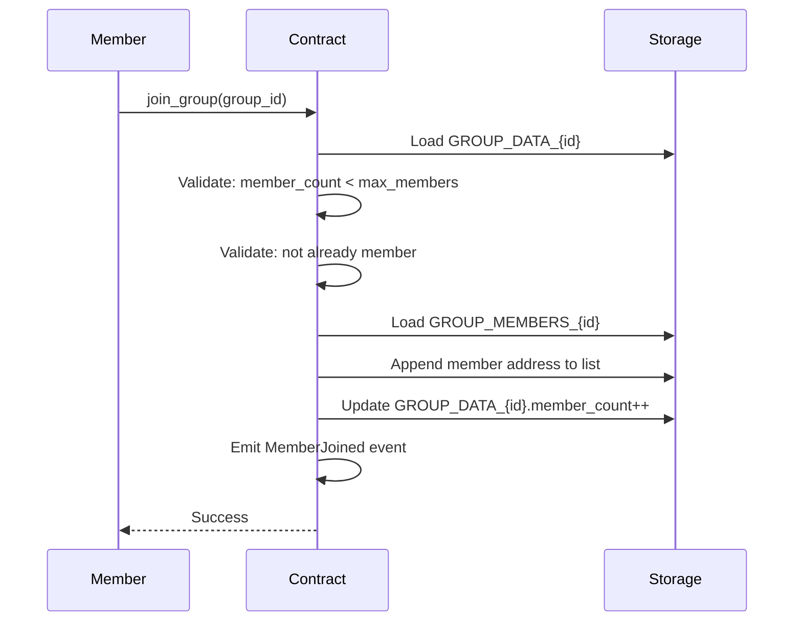
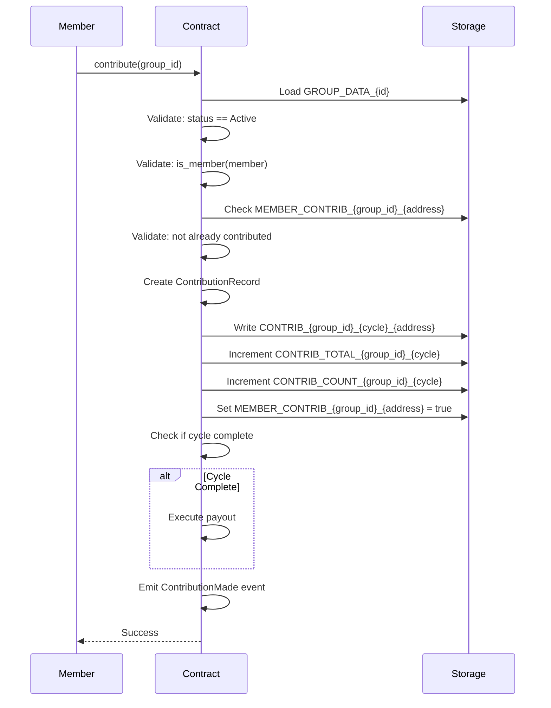
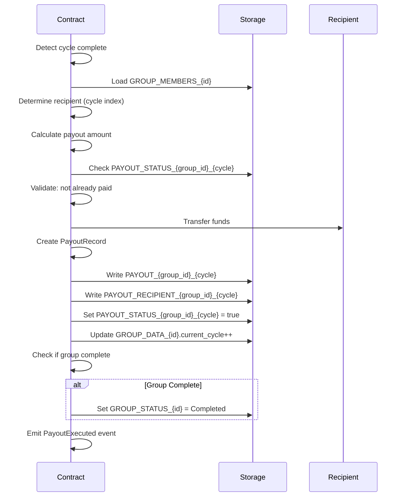

# Stellar-Save Storage Layout Documentation

## Table of Contents
1. [Overview](#overview)
2. [Storage Architecture](#storage-architecture)
3. [Storage Key Structure](#storage-key-structure)
4. [Data Structures](#data-structures)
5. [Storage Keys Reference](#storage-keys-reference)
6. [Member Tracking Mechanism](#member-tracking-mechanism)
7. [Contribution Tracking](#contribution-tracking)
8. [Payout Queue Management](#payout-queue-management)
9. [Storage Evolution](#storage-evolution)
10. [Storage Cost Analysis](#storage-cost-analysis)

---

## Overview

The Stellar-Save smart contract uses Soroban's persistent storage to maintain all state related to rotational savings groups (ROSCAs). This document provides a comprehensive breakdown of the storage layout, key derivation, data structures, and storage cost implications.

### Storage Types

Soroban provides two storage types:
- **Persistent Storage**: Long-lived data that persists across contract invocations
- **Temporary Storage**: Short-lived data (not currently used in this contract)

Stellar-Save exclusively uses **persistent storage** for all data.

### Key Design Principles

1. **Hierarchical Key Structure**: Keys are organized by category (Group, Member, Contribution, Payout, Counter)
2. **Efficient Lookups**: Direct key access for O(1) retrieval
3. **Namespace Isolation**: Different data types use distinct key prefixes
4. **Composite Keys**: Multi-part keys for relational data (e.g., group_id + address)
5. **Immutable Records**: Contribution and payout records are write-once

---

## Storage Architecture

### Storage Layer Diagram




### Storage Access Patterns

**Write Operations:**
- Group creation: Write Group, Status, initialize counters
- Member join: Append to member list, write member profile
- Contribution: Write contribution record, update totals/counts
- Payout: Write payout record, update status

**Read Operations:**
- Get group: Direct key lookup
- List members: Read member list vector
- Check contribution: Read individual contribution record
- Validate cycle: Read cycle totals and counts

---

## Storage Key Structure

### Key Hierarchy

All storage keys follow a hierarchical enum structure defined in `storage.rs`:

```rust
pub enum StorageKey {
    Group(GroupKey),           // Group-related data
    Member(MemberKey),         // Member-related data
    Contribution(ContributionKey), // Contribution tracking
    Payout(PayoutKey),         // Payout records
    Counter(CounterKey),       // Global counters
}
```

### Key Derivation

Keys are derived using the `StorageKeyBuilder` utility, which provides type-safe key construction:

```rust
// Example: Build a group data key
let key = StorageKeyBuilder::group_data(group_id);
// Produces: StorageKey::Group(GroupKey::Data(group_id))

// Example: Build a contribution key
let key = StorageKeyBuilder::contribution_individual(group_id, cycle, address);
// Produces: StorageKey::Contribution(ContributionKey::Individual(group_id, cycle, address))
```

### Key Namespacing

Keys are namespaced by their enum variant, ensuring no collisions between different data types:

- `Group(*)` - All group-related keys
- `Member(*)` - All member-related keys
- `Contribution(*)` - All contribution-related keys
- `Payout(*)` - All payout-related keys
- `Counter(*)` - All counter-related keys

---

## Data Structures

### Group Structure

The `Group` struct is the core data structure representing a ROSCA group.

**Definition:**
```rust
#[contracttype]
pub struct Group {
    pub id: u64,
    pub creator: Address,
    pub contribution_amount: i128,
    pub cycle_duration: u64,
    pub max_members: u32,
    pub min_members: u32,
    pub member_count: u32,
    pub current_cycle: u32,
    pub is_active: bool,
    pub status: GroupStatus,
    pub created_at: u64,
    pub started: bool,
    pub started_at: u64,
}
```

**Field Breakdown:**

| Field | Type | Size (bytes) | Purpose | Lifecycle |
|-------|------|--------------|---------|-----------|
| `id` | u64 | 8 | Unique group identifier | Immutable after creation |
| `creator` | Address | 32 | Group creator's address | Immutable after creation |
| `contribution_amount` | i128 | 16 | Fixed contribution per member (stroops) | Mutable in Pending state |
| `cycle_duration` | u64 | 8 | Cycle length in seconds | Mutable in Pending state |
| `max_members` | u32 | 4 | Maximum allowed members | Mutable in Pending state |
| `min_members` | u32 | 4 | Minimum required to activate | Immutable after creation |
| `member_count` | u32 | 4 | Current number of members | Increments on join |
| `current_cycle` | u32 | 4 | Current cycle number (0-indexed) | Increments after payout |
| `is_active` | bool | 1 | Whether group accepts contributions | Changes with status |
| `status` | GroupStatus | 4 | Current lifecycle state | Transitions per state machine |
| `created_at` | u64 | 8 | Creation timestamp | Immutable after creation |
| `started` | bool | 1 | Whether first cycle started | Set once on activation |
| `started_at` | u64 | 8 | Activation timestamp | Set once on activation |

**Total Size:** ~102 bytes (excluding Soroban overhead)

**Functional Roles:**

1. **Identity Fields** (`id`, `creator`): Uniquely identify the group and its owner
2. **Configuration Fields** (`contribution_amount`, `cycle_duration`, `max_members`, `min_members`): Define group rules
3. **State Fields** (`member_count`, `current_cycle`, `is_active`, `status`): Track current state
4. **Lifecycle Fields** (`created_at`, `started`, `started_at`): Track temporal progression

**Invariants:**
- `contribution_amount > 0`
- `cycle_duration > 0`
- `max_members >= 2`
- `min_members >= 2`
- `min_members <= max_members`
- `member_count <= max_members`
- `current_cycle <= max_members`


### GroupStatus Enum

Represents the lifecycle state of a group.

**Definition:**
```rust
#[contracttype]
pub enum GroupStatus {
    Pending = 0,
    Active = 1,
    Paused = 2,
    Completed = 3,
    Cancelled = 4,
}
```

**Storage:** 4 bytes (u32 representation)

**State Transitions:**
- Pending → Active, Cancelled
- Active → Paused, Completed, Cancelled
- Paused → Active, Cancelled
- Completed → (terminal)
- Cancelled → (terminal)

### ContributionRecord Structure

Tracks individual member contributions.

**Definition:**
```rust
#[contracttype]
pub struct ContributionRecord {
    pub member_address: Address,
    pub group_id: u64,
    pub cycle_number: u32,
    pub amount: i128,
    pub timestamp: u64,
}
```

**Field Breakdown:**

| Field | Type | Size (bytes) | Purpose |
|-------|------|--------------|---------|
| `member_address` | Address | 32 | Contributing member |
| `group_id` | u64 | 8 | Group identifier |
| `cycle_number` | u32 | 4 | Cycle when contributed |
| `amount` | i128 | 16 | Contribution amount (stroops) |
| `timestamp` | u64 | 8 | Contribution time |

**Total Size:** ~68 bytes

**Immutability:** Once written, contribution records are never modified.

### PayoutRecord Structure

Tracks payout distributions.

**Definition:**
```rust
#[contracttype]
pub struct PayoutRecord {
    pub recipient: Address,
    pub group_id: u64,
    pub cycle_number: u32,
    pub amount: i128,
    pub timestamp: u64,
}
```

**Field Breakdown:**

| Field | Type | Size (bytes) | Purpose |
|-------|------|--------------|---------|
| `recipient` | Address | 32 | Payout recipient |
| `group_id` | u64 | 8 | Group identifier |
| `cycle_number` | u32 | 4 | Cycle when paid |
| `amount` | i128 | 16 | Payout amount (stroops) |
| `timestamp` | u64 | 8 | Payout time |

**Total Size:** ~68 bytes

**Immutability:** Once written, payout records are never modified.

### PoolInfo Structure

Runtime calculation structure (not stored).

**Definition:**
```rust
#[contracttype]
pub struct PoolInfo {
    pub group_id: u64,
    pub cycle: u32,
    pub member_count: u32,
    pub contribution_amount: i128,
    pub total_pool_amount: i128,
    pub current_contributions: i128,
    pub contributors_count: u32,
    pub is_cycle_complete: bool,
}
```

**Note:** This structure is computed on-demand and not persisted to storage.

---

## Storage Keys Reference

### Group Keys

#### GROUP_DATA_{id}
**Key:** `StorageKey::Group(GroupKey::Data(group_id))`  
**Type:** `Group`  
**Purpose:** Stores the complete Group struct  
**Access Pattern:** Direct lookup by group_id  
**Lifecycle:** Created on group creation, updated on configuration changes, deleted on group deletion

**Example:**
```rust
let key = StorageKeyBuilder::group_data(1);
let group: Group = env.storage().persistent().get(&key)?;
```

#### GROUP_MEMBERS_{id}
**Key:** `StorageKey::Group(GroupKey::Members(group_id))`  
**Type:** `Vec<Address>`  
**Purpose:** Stores ordered list of member addresses  
**Access Pattern:** Direct lookup, append on join  
**Lifecycle:** Initialized empty on creation, grows as members join

**Example:**
```rust
let key = StorageKeyBuilder::group_members(1);
let members: Vec<Address> = env.storage().persistent().get(&key)?;
```

**Storage Growth:** 32 bytes per member

#### GROUP_STATUS_{id}
**Key:** `StorageKey::Group(GroupKey::Status(group_id))`  
**Type:** `GroupStatus`  
**Purpose:** Stores current group status  
**Access Pattern:** Direct lookup, updated on state transitions  
**Lifecycle:** Set to Pending on creation, transitions per state machine

**Example:**
```rust
let key = StorageKeyBuilder::group_status(1);
let status: GroupStatus = env.storage().persistent().get(&key)?;
```


### Member Keys

#### MEMBER_PROFILE_{group_id}_{address}
**Key:** `StorageKey::Member(MemberKey::Profile(group_id, address))`  
**Type:** `MemberProfile` (currently not implemented as separate struct)  
**Purpose:** Stores member-specific data  
**Access Pattern:** Direct lookup by group_id and address  
**Lifecycle:** Created when member joins, persists until group completion

**Note:** Currently, member data is tracked via the GROUP_MEMBERS list. Individual profiles are planned for future implementation.

#### MEMBER_CONTRIB_{group_id}_{address}
**Key:** `StorageKey::Member(MemberKey::ContributionStatus(group_id, address))`  
**Type:** `bool`  
**Purpose:** Tracks if member contributed in current cycle  
**Access Pattern:** Direct lookup, set on contribution, reset on cycle advance  
**Lifecycle:** Set to true on contribution, reset to false on new cycle

**Example:**
```rust
let key = StorageKeyBuilder::member_contribution_status(group_id, member_address);
let has_contributed: bool = env.storage().persistent().get(&key).unwrap_or(false);
```

#### MEMBER_PAYOUT_{group_id}_{address}
**Key:** `StorageKey::Member(MemberKey::PayoutEligibility(group_id, address))`  
**Type:** `PayoutEligibility` (planned)  
**Purpose:** Tracks payout turn order and eligibility  
**Access Pattern:** Direct lookup, updated after payout  
**Lifecycle:** Initialized on member join, updated after receiving payout

**Note:** Payout ordering is currently determined by join order (position in GROUP_MEMBERS list).

### Contribution Keys

#### CONTRIB_{group_id}_{cycle}_{address}
**Key:** `StorageKey::Contribution(ContributionKey::Individual(group_id, cycle, address))`  
**Type:** `ContributionRecord`  
**Purpose:** Stores individual contribution details  
**Access Pattern:** Direct lookup, write-once  
**Lifecycle:** Created on contribution, never modified

**Example:**
```rust
let key = StorageKeyBuilder::contribution_individual(group_id, cycle, member_address);
let contribution: ContributionRecord = env.storage().persistent().get(&key)?;
```

**Storage per Contribution:** ~68 bytes

#### CONTRIB_TOTAL_{group_id}_{cycle}
**Key:** `StorageKey::Contribution(ContributionKey::CycleTotal(group_id, cycle))`  
**Type:** `i128`  
**Purpose:** Stores total contributions for a cycle  
**Access Pattern:** Read on validation, incremented on each contribution  
**Lifecycle:** Initialized to 0, incremented with each contribution

**Example:**
```rust
let key = StorageKeyBuilder::contribution_cycle_total(group_id, cycle);
let total: i128 = env.storage().persistent().get(&key).unwrap_or(0);
```

#### CONTRIB_COUNT_{group_id}_{cycle}
**Key:** `StorageKey::Contribution(ContributionKey::CycleCount(group_id, cycle))`  
**Type:** `u32`  
**Purpose:** Counts how many members contributed in cycle  
**Access Pattern:** Read on validation, incremented on each contribution  
**Lifecycle:** Initialized to 0, incremented with each contribution

**Example:**
```rust
let key = StorageKeyBuilder::contribution_cycle_count(group_id, cycle);
let count: u32 = env.storage().persistent().get(&key).unwrap_or(0);
```

**Cycle Completion Check:**
```rust
let count = get_cycle_contributor_count(env, group_id, cycle)?;
let member_count = get_member_count(env, group_id)?;
let is_complete = count >= member_count;
```

### Payout Keys

#### PAYOUT_{group_id}_{cycle}
**Key:** `StorageKey::Payout(PayoutKey::Record(group_id, cycle))`  
**Type:** `PayoutRecord`  
**Purpose:** Stores complete payout details  
**Access Pattern:** Direct lookup, write-once  
**Lifecycle:** Created on payout execution, never modified

**Example:**
```rust
let key = StorageKeyBuilder::payout_record(group_id, cycle);
let payout: PayoutRecord = env.storage().persistent().get(&key)?;
```

**Storage per Payout:** ~68 bytes

#### PAYOUT_RECIPIENT_{group_id}_{cycle}
**Key:** `StorageKey::Payout(PayoutKey::Recipient(group_id, cycle))`  
**Type:** `Address`  
**Purpose:** Quick lookup for payout recipient  
**Access Pattern:** Direct lookup  
**Lifecycle:** Set on payout execution

**Example:**
```rust
let key = StorageKeyBuilder::payout_recipient(group_id, cycle);
let recipient: Address = env.storage().persistent().get(&key)?;
```

#### PAYOUT_STATUS_{group_id}_{cycle}
**Key:** `StorageKey::Payout(PayoutKey::Status(group_id, cycle))`  
**Type:** `bool`  
**Purpose:** Tracks if payout has been processed  
**Access Pattern:** Check before payout, set after payout  
**Lifecycle:** Set to true on payout execution

**Example:**
```rust
let key = StorageKeyBuilder::payout_status(group_id, cycle);
let is_paid: bool = env.storage().persistent().get(&key).unwrap_or(false);
```


### Counter Keys

#### COUNTER_GROUP_ID
**Key:** `StorageKey::Counter(CounterKey::NextGroupId)`  
**Type:** `u64`  
**Purpose:** Generates unique sequential group IDs  
**Access Pattern:** Read-increment-write on group creation  
**Lifecycle:** Initialized to 0, monotonically increasing

**Example:**
```rust
let key = StorageKeyBuilder::next_group_id();
let current_id: u64 = env.storage().persistent().get(&key).unwrap_or(0);
let next_id = current_id.checked_add(1)?;
env.storage().persistent().set(&key, &next_id);
```

**Overflow Protection:** Uses `checked_add()` to prevent overflow

#### COUNTER_TOTAL_GROUPS
**Key:** `StorageKey::Counter(CounterKey::TotalGroups)`  
**Type:** `u64`  
**Purpose:** Tracks total groups ever created  
**Access Pattern:** Incremented on group creation  
**Lifecycle:** Initialized to 0, monotonically increasing

**Note:** Currently, this counter is derived from COUNTER_GROUP_ID rather than stored separately.

#### COUNTER_ACTIVE_GROUPS
**Key:** `StorageKey::Counter(CounterKey::ActiveGroups)`  
**Type:** `u64`  
**Purpose:** Tracks currently active groups  
**Access Pattern:** Incremented on activation, decremented on completion/cancellation  
**Lifecycle:** Initialized to 0, increases and decreases

**Note:** Not currently implemented in the contract.

#### COUNTER_TOTAL_MEMBERS
**Key:** `StorageKey::Counter(CounterKey::TotalMembers)`  
**Type:** `u64`  
**Purpose:** Global member count across all groups  
**Access Pattern:** Incremented when member joins any group  
**Lifecycle:** Initialized to 0, monotonically increasing

**Note:** Not currently implemented in the contract.

#### COUNTER_VERSION
**Key:** `StorageKey::Counter(CounterKey::ContractVersion)`  
**Type:** `u32`  
**Purpose:** Tracks contract version for upgrade compatibility  
**Access Pattern:** Set on deployment, updated on upgrades  
**Lifecycle:** Set once, rarely updated

**Note:** Not currently implemented in the contract.

#### CONTRACT_CONFIG
**Key:** `StorageKey::Counter(CounterKey::ContractConfig)`  
**Type:** `ContractConfig`  
**Purpose:** Stores global contract configuration  
**Access Pattern:** Read on validation, updated by admin  
**Lifecycle:** Set on initialization, updated by admin

**ContractConfig Structure:**
```rust
pub struct ContractConfig {
    pub admin: Address,
    pub min_contribution: i128,
    pub max_contribution: i128,
    pub min_members: u32,
    pub max_members: u32,
    pub min_cycle_duration: u64,
    pub max_cycle_duration: u64,
}
```

**Example:**
```rust
let key = StorageKeyBuilder::contract_config();
let config: ContractConfig = env.storage().persistent().get(&key)?;
```

---

## Member Tracking Mechanism

### Member Addition Flow



### Member Storage Structure

**Primary Storage:**
```
GROUP_MEMBERS_{group_id} → Vec<Address>
```

**Example for group_id=1 with 3 members:**
```
GROUP_MEMBERS_1 → [
    Address("GABC..."),
    Address("GDEF..."),
    Address("GHIJ...")
]
```

### Member Indexing

Members are indexed by their position in the GROUP_MEMBERS vector:
- Index 0: First member (typically the creator)
- Index 1: Second member
- Index N: (N+1)th member

**Payout Order:** Determined by join order (vector index)

### Member Validation

**Membership Check:**
```rust
fn is_member(env: &Env, group_id: u64, address: &Address) -> bool {
    let key = StorageKeyBuilder::group_members(group_id);
    let members: Vec<Address> = env.storage().persistent().get(&key).unwrap_or(Vec::new(&env));
    members.contains(address)
}
```

**Duplicate Prevention:**
- Check membership before adding
- Reject if address already in GROUP_MEMBERS list

### Member State Transitions

**Join → Active Contributor:**
1. Member joins (added to GROUP_MEMBERS)
2. Group activates (status: Pending → Active)
3. Member can now contribute

**Active Contributor → Payout Recipient:**
1. Member contributes each cycle
2. Member's turn arrives (based on join order)
3. Member receives payout
4. Member continues contributing in subsequent cycles

**Payout Recipient → Completed:**
1. All members receive their payout
2. Group status: Active → Completed
3. No further contributions or payouts

### Member Count Tracking

**Increment on Join:**
```rust
group.member_count += 1;
env.storage().persistent().set(&group_key, &group);
```

**Validation:**
```rust
assert!(group.member_count <= group.max_members, "group is full");
```

**Activation Check:**
```rust
if group.member_count >= group.min_members {
    // Group can be activated
}
```


---

## Contribution Tracking

### Contribution Recording Flow



### Individual Contribution Storage

**Key Pattern:**
```
CONTRIB_{group_id}_{cycle}_{member_address} → ContributionRecord
```

**Example for group_id=1, cycle=0:**
```
CONTRIB_1_0_GABC... → ContributionRecord {
    member_address: "GABC...",
    group_id: 1,
    cycle_number: 0,
    amount: 10_000_000,
    timestamp: 1234567890
}

CONTRIB_1_0_GDEF... → ContributionRecord {
    member_address: "GDEF...",
    group_id: 1,
    cycle_number: 0,
    amount: 10_000_000,
    timestamp: 1234567895
}
```

### Contribution Aggregation

**Cycle Total Tracking:**
```
CONTRIB_TOTAL_{group_id}_{cycle} → i128
```

**Update on Each Contribution:**
```rust
let total_key = StorageKeyBuilder::contribution_cycle_total(group_id, cycle);
let current_total: i128 = env.storage().persistent().get(&total_key).unwrap_or(0);
let new_total = current_total.checked_add(contribution_amount)?;
env.storage().persistent().set(&total_key, &new_total);
```

**Cycle Count Tracking:**
```
CONTRIB_COUNT_{group_id}_{cycle} → u32
```

**Update on Each Contribution:**
```rust
let count_key = StorageKeyBuilder::contribution_cycle_count(group_id, cycle);
let current_count: u32 = env.storage().persistent().get(&count_key).unwrap_or(0);
let new_count = current_count.checked_add(1)?;
env.storage().persistent().set(&count_key, &new_count);
```

### Contribution Validation

**Pre-Contribution Checks:**
1. Group exists and is Active
2. Caller is a member
3. Member hasn't contributed this cycle
4. Contribution amount matches group requirement

**Validation Code:**
```rust
// Check group status
let status = get_group_status(env, group_id)?;
if status != GroupStatus::Active {
    return Err(StellarSaveError::InvalidState);
}

// Check membership
if !is_member(env, group_id, &member) {
    return Err(StellarSaveError::NotMember);
}

// Check duplicate contribution
let contrib_status_key = StorageKeyBuilder::member_contribution_status(group_id, member.clone());
let already_contributed: bool = env.storage().persistent().get(&contrib_status_key).unwrap_or(false);
if already_contributed {
    return Err(StellarSaveError::AlreadyContributed);
}

// Validate amount
if amount != group.contribution_amount {
    return Err(StellarSaveError::InvalidAmount);
}
```

### Cycle Completion Detection

**Completion Check:**
```rust
let count = get_cycle_contributor_count(env, group_id, cycle)?;
let member_count = get_member_count(env, group_id)?;

if count >= member_count {
    // Cycle is complete, trigger payout
    execute_payout(env, group_id, cycle)?;
}
```

**Validation Before Payout:**
```rust
let total = get_cycle_contributions_total(env, group_id, cycle)?;
let expected = group.contribution_amount * (member_count as i128);

if total != expected {
    return Err(StellarSaveError::InvalidAmount);
}
```

### Contribution History

**Query Individual Contribution:**
```rust
let key = StorageKeyBuilder::contribution_individual(group_id, cycle, member_address);
let contribution: Option<ContributionRecord> = env.storage().persistent().get(&key);
```

**Query Cycle Summary:**
```rust
let total_key = StorageKeyBuilder::contribution_cycle_total(group_id, cycle);
let count_key = StorageKeyBuilder::contribution_cycle_count(group_id, cycle);

let total: i128 = env.storage().persistent().get(&total_key).unwrap_or(0);
let count: u32 = env.storage().persistent().get(&count_key).unwrap_or(0);
```

### Contribution Reset on Cycle Advance

When a cycle completes and advances:
1. Individual contribution records remain (immutable history)
2. MEMBER_CONTRIB status flags are reset to false
3. New cycle starts with CONTRIB_TOTAL and CONTRIB_COUNT at 0

**Reset Logic:**
```rust
// After payout, advance cycle
group.current_cycle += 1;

// Member contribution status is implicitly reset
// (new cycle number means different keys are checked)
```


---

## Payout Queue Management

### Payout Order Determination

**Current Implementation:**
Payout order is determined by join order (position in GROUP_MEMBERS vector).

**Recipient Selection:**
```rust
fn get_next_recipient(env: &Env, group_id: u64, cycle: u32) -> Result<Address, StellarSaveError> {
    let members_key = StorageKeyBuilder::group_members(group_id);
    let members: Vec<Address> = env.storage().persistent().get(&members_key)?;
    
    // Cycle number corresponds to member index
    let recipient_index = cycle as usize;
    
    if recipient_index >= members.len() {
        return Err(StellarSaveError::InvalidRecipient);
    }
    
    Ok(members.get(recipient_index).unwrap())
}
```

**Example for 5-member group:**
- Cycle 0: Member at index 0 receives payout
- Cycle 1: Member at index 1 receives payout
- Cycle 2: Member at index 2 receives payout
- Cycle 3: Member at index 3 receives payout
- Cycle 4: Member at index 4 receives payout
- Group completes after cycle 4

### Payout Execution Flow



### Payout Storage

**Payout Record:**
```
PAYOUT_{group_id}_{cycle} → PayoutRecord
```

**Example:**
```
PAYOUT_1_0 → PayoutRecord {
    recipient: "GABC...",
    group_id: 1,
    cycle_number: 0,
    amount: 50_000_000,  // 5 members × 10 XLM
    timestamp: 1234567900
}
```

**Recipient Quick Lookup:**
```
PAYOUT_RECIPIENT_{group_id}_{cycle} → Address
```

**Payout Status Flag:**
```
PAYOUT_STATUS_{group_id}_{cycle} → bool
```

### Payout Invariants

**Critical Invariants:**
1. Each cycle has exactly one payout
2. Each member receives exactly one payout
3. Payout amount = contribution_amount × member_count
4. Payout only occurs when all members contributed
5. Payout records are immutable once created

**Enforcement:**
```rust
// Check not already paid
let status_key = StorageKeyBuilder::payout_status(group_id, cycle);
let already_paid: bool = env.storage().persistent().get(&status_key).unwrap_or(false);
if already_paid {
    return Err(StellarSaveError::PayoutAlreadyProcessed);
}

// Validate cycle complete
let pool_info = PoolCalculator::get_pool_info(env, group_id, cycle)?;
PoolCalculator::validate_pool_ready_for_payout(&pool_info)?;

// Calculate and validate amount
let payout_amount = pool_info.total_pool_amount;
assert_eq!(payout_amount, group.contribution_amount * (group.max_members as i128));
```

### Payout Queue Properties

**Ordering Guarantees:**
1. **FIFO by Join Order**: First member to join receives first payout
2. **Sequential**: Payouts occur in cycle order (0, 1, 2, ...)
3. **Deterministic**: Same join order always produces same payout order
4. **No Skipping**: Cannot skip a member's turn

**No Explicit Queue Structure:**
- No separate queue data structure
- Order implicitly defined by GROUP_MEMBERS vector
- Current cycle number acts as queue pointer

**Queue Advancement:**
```rust
// After payout
group.current_cycle += 1;

// Next recipient is at index = new current_cycle
let next_recipient = members.get(group.current_cycle as usize);
```

### Payout History Queries

**Get Payout for Cycle:**
```rust
let key = StorageKeyBuilder::payout_record(group_id, cycle);
let payout: PayoutRecord = env.storage().persistent().get(&key)?;
```

**Check if Cycle Paid:**
```rust
let key = StorageKeyBuilder::payout_status(group_id, cycle);
let is_paid: bool = env.storage().persistent().get(&key).unwrap_or(false);
```

**Get Recipient for Cycle:**
```rust
let key = StorageKeyBuilder::payout_recipient(group_id, cycle);
let recipient: Address = env.storage().persistent().get(&key)?;
```

### Payout Completion

**Group Completion Check:**
```rust
if group.current_cycle >= group.max_members {
    // All members have received payout
    group.status = GroupStatus::Completed;
    group.is_active = false;
    
    // Emit GroupCompleted event
    EventEmitter::emit_group_completed(
        env,
        group.id,
        group.creator,
        group.max_members,
        total_distributed,
        env.ledger().timestamp()
    );
}
```


---

## Storage Evolution

### Lifecycle Storage Patterns

#### Phase 1: Group Creation
**Storage Written:**
- `GROUP_DATA_{id}` → Group struct
- `GROUP_STATUS_{id}` → Pending
- `GROUP_MEMBERS_{id}` → Empty Vec
- `COUNTER_GROUP_ID` → Incremented

**Storage Size:** ~150 bytes

#### Phase 2: Member Joining
**Storage Written per Member:**
- `GROUP_MEMBERS_{id}` → Append address (32 bytes)
- `GROUP_DATA_{id}` → Update member_count

**Storage Growth:** +32 bytes per member

**Example for 5 members:** 150 + (5 × 32) = 310 bytes

#### Phase 3: Group Activation
**Storage Written:**
- `GROUP_STATUS_{id}` → Active
- `GROUP_DATA_{id}` → Update started, started_at

**Storage Change:** Minimal (status update)

#### Phase 4: Contribution Cycle
**Storage Written per Contribution:**
- `CONTRIB_{group_id}_{cycle}_{address}` → ContributionRecord (68 bytes)
- `CONTRIB_TOTAL_{group_id}_{cycle}` → Update total (16 bytes)
- `CONTRIB_COUNT_{group_id}_{cycle}` → Update count (4 bytes)
- `MEMBER_CONTRIB_{group_id}_{address}` → Set true (1 byte)

**Storage per Cycle:** ~89 bytes per member

**Example for 5 members, 1 cycle:** 5 × 89 = 445 bytes

#### Phase 5: Payout
**Storage Written per Payout:**
- `PAYOUT_{group_id}_{cycle}` → PayoutRecord (68 bytes)
- `PAYOUT_RECIPIENT_{group_id}_{cycle}` → Address (32 bytes)
- `PAYOUT_STATUS_{group_id}_{cycle}` → true (1 byte)
- `GROUP_DATA_{id}` → Update current_cycle

**Storage per Payout:** ~101 bytes

#### Phase 6: Group Completion
**Storage Written:**
- `GROUP_STATUS_{id}` → Completed
- `GROUP_DATA_{id}` → Update is_active

**Storage Change:** Minimal (status update)

### Storage Growth Over Time

**Formula for Complete Group:**
```
Total Storage = Base + Members + Contributions + Payouts

Where:
- Base = 150 bytes (group data + status)
- Members = 32 × member_count
- Contributions = 89 × member_count × cycles
- Payouts = 101 × cycles
- cycles = member_count (one cycle per member)
```

**Simplified:**
```
Total Storage = 150 + (32 × M) + (89 × M × M) + (101 × M)
              = 150 + 133M + 89M²

Where M = member_count
```

**Examples:**

| Members | Base | Members | Contributions | Payouts | Total |
|---------|------|---------|---------------|---------|-------|
| 2 | 150 | 64 | 356 | 202 | 772 bytes |
| 5 | 150 | 160 | 2,225 | 505 | 3,040 bytes |
| 10 | 150 | 320 | 8,900 | 1,010 | 10,380 bytes |
| 20 | 150 | 640 | 35,600 | 2,020 | 38,410 bytes |
| 50 | 150 | 1,600 | 222,500 | 5,050 | 229,300 bytes |

### Storage Retention

**Permanent Storage:**
- Group data (until manual deletion)
- Member lists (until group deletion)
- Contribution records (immutable history)
- Payout records (immutable history)

**No Automatic Cleanup:**
- Completed groups remain in storage
- Historical records persist indefinitely
- No garbage collection mechanism

**Manual Cleanup:**
- `delete_group()` can remove Pending groups with no members
- No mechanism to delete Active/Completed groups

### Storage Access Frequency

**High Frequency (per transaction):**
- GROUP_DATA read/write
- GROUP_STATUS read
- MEMBER_CONTRIB read/write
- CONTRIB_TOTAL, CONTRIB_COUNT read/write

**Medium Frequency (per cycle):**
- GROUP_MEMBERS read
- PAYOUT_* write

**Low Frequency (rare):**
- CONTRACT_CONFIG read
- COUNTER_GROUP_ID read/write

### Storage Optimization Strategies

**Current Optimizations:**
1. **Composite Keys**: Reduce key count by combining related data
2. **Aggregated Totals**: Store cycle totals instead of recalculating
3. **Status Flags**: Use booleans for quick checks
4. **Direct Lookups**: O(1) access via direct keys

**Potential Future Optimizations:**
1. **Archival**: Move completed groups to separate storage
2. **Compression**: Compress historical records
3. **Pruning**: Optional deletion of old contribution records
4. **Indexing**: Secondary indices for common queries


---

## Storage Cost Analysis

### Stellar Storage Pricing

Soroban storage costs are based on:
1. **Storage Size**: Bytes stored
2. **Storage Duration**: How long data is stored
3. **Storage Type**: Persistent vs Temporary

**Current Stellar Pricing (Testnet/Mainnet):**
- Storage is paid via rent
- Rent extends storage lifetime
- Costs measured in stroops per byte per ledger

**Note:** Exact pricing may vary. Consult [Stellar documentation](https://soroban.stellar.org/) for current rates.

### Cost Breakdown by Component

#### Group Creation Cost
**Storage:** ~150 bytes  
**Components:**
- Group struct: ~102 bytes
- Status enum: ~4 bytes
- Empty member list: ~20 bytes (vector overhead)
- Storage key overhead: ~24 bytes

**Estimated Cost:** Minimal (one-time)

#### Member Addition Cost
**Storage per Member:** ~32 bytes  
**Components:**
- Address in member list: 32 bytes

**Estimated Cost:** Low (per member)

**Example:**
- 5 members: 5 × 32 = 160 bytes
- 10 members: 10 × 32 = 320 bytes

#### Contribution Cost
**Storage per Contribution:** ~89 bytes  
**Components:**
- ContributionRecord: 68 bytes
- Cycle total update: 16 bytes (i128)
- Cycle count update: 4 bytes (u32)
- Member status flag: 1 byte

**Estimated Cost:** Medium (per contribution)

**Example for 5-member group:**
- Per cycle: 5 × 89 = 445 bytes
- All cycles: 5 × 445 = 2,225 bytes

#### Payout Cost
**Storage per Payout:** ~101 bytes  
**Components:**
- PayoutRecord: 68 bytes
- Recipient address: 32 bytes
- Status flag: 1 byte

**Estimated Cost:** Medium (per payout)

**Example for 5-member group:**
- Total payouts: 5 × 101 = 505 bytes

### Total Cost Estimates

#### Small Group (5 members)
```
Base:          150 bytes
Members:       160 bytes (5 × 32)
Contributions: 2,225 bytes (5 × 5 × 89)
Payouts:       505 bytes (5 × 101)
─────────────────────────
Total:         3,040 bytes (~3 KB)
```

#### Medium Group (10 members)
```
Base:          150 bytes
Members:       320 bytes (10 × 32)
Contributions: 8,900 bytes (10 × 10 × 89)
Payouts:       1,010 bytes (10 × 101)
─────────────────────────
Total:         10,380 bytes (~10 KB)
```

#### Large Group (20 members)
```
Base:          150 bytes
Members:       640 bytes (20 × 32)
Contributions: 35,600 bytes (20 × 20 × 89)
Payouts:       2,020 bytes (20 × 101)
─────────────────────────
Total:         38,410 bytes (~38 KB)
```

#### Very Large Group (50 members)
```
Base:          150 bytes
Members:       1,600 bytes (50 × 32)
Contributions: 222,500 bytes (50 × 50 × 89)
Payouts:       5,050 bytes (50 × 101)
─────────────────────────
Total:         229,300 bytes (~224 KB)
```

### Cost Scaling Analysis

**Storage Growth Pattern:**
- **Linear with Members**: Member list grows linearly (32M bytes)
- **Quadratic with Members**: Contributions grow quadratically (89M² bytes)
- **Linear with Cycles**: Payouts grow linearly (101M bytes)

**Dominant Factor:** Contribution storage (quadratic growth)

**Graph:**
```
Storage (KB)
│
250 │                                        ●
    │                                   ●
200 │                              ●
    │                         ●
150 │                    ●
    │               ●
100 │          ●
    │     ●
 50 │ ●
    │●
  0 └─────────────────────────────────────
    0   5   10  15  20  25  30  35  40  45  50
                    Members
```

### Cost Optimization Recommendations

**For Small Groups (≤10 members):**
- Storage costs are minimal
- No optimization needed
- Focus on functionality

**For Medium Groups (11-20 members):**
- Storage costs are moderate
- Consider contribution record pruning after completion
- Monitor storage usage

**For Large Groups (>20 members):**
- Storage costs become significant
- Implement archival strategy for completed groups
- Consider off-chain storage for historical data
- Use event logs for audit trail instead of full records

### Cost Comparison

**Traditional ROSCA (Off-Chain):**
- No blockchain storage costs
- Requires trusted coordinator
- No transparency guarantees

**Stellar-Save (On-Chain):**
- Storage costs: ~3-40 KB per group
- No trusted coordinator needed
- Full transparency and auditability
- Immutable audit trail

**Trade-off:** Higher storage costs for trustlessness and transparency

### Future Cost Reduction Strategies

1. **Selective Storage**: Store only essential data on-chain
2. **Event-Based History**: Use events instead of full records
3. **Compression**: Compress contribution/payout records
4. **Archival**: Move completed groups to cheaper storage tier
5. **Pruning**: Optional deletion of old records with member consent

---

## Summary

### Key Takeaways

1. **Storage Structure**: Hierarchical key-value storage with clear namespacing
2. **Data Structures**: Well-defined structs with validation and invariants
3. **Member Tracking**: Vector-based with join-order indexing
4. **Contribution Tracking**: Individual records + aggregated totals
5. **Payout Queue**: Implicit queue via member list indexing
6. **Storage Growth**: Quadratic with member count (dominated by contributions)
7. **Cost Estimates**: 3-40 KB for typical groups (5-20 members)

### Storage Best Practices

1. **Use StorageKeyBuilder**: Type-safe key construction
2. **Validate Before Write**: Prevent invalid state
3. **Check Existence**: Use `unwrap_or()` for optional data
4. **Immutable Records**: Never modify contribution/payout records
5. **Atomic Updates**: Update related data together
6. **Overflow Protection**: Use `checked_*()` arithmetic

### References

- [Soroban Storage Documentation](https://soroban.stellar.org/docs/learn/storage)
- [Storage Keys Implementation](../contracts/stellar-save/src/storage.rs)
- [Group Structure](../contracts/stellar-save/src/group.rs)
- [Contribution Tracking](../contracts/stellar-save/src/contribution.rs)
- [Payout Management](../contracts/stellar-save/src/payout.rs)
- [Pool Calculations](../POOL_CALCULATION.md)
- [Architecture Overview](./architecture.md)

---

**Document Version:** 1.0  
**Last Updated:** 2024  
**Contract Version:** 0.1.0  
**Soroban SDK:** 23.0.3
