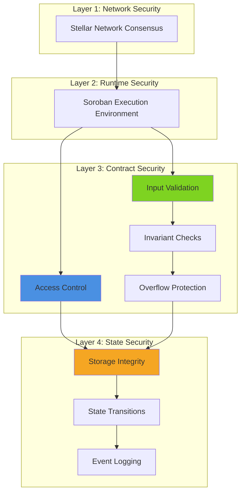
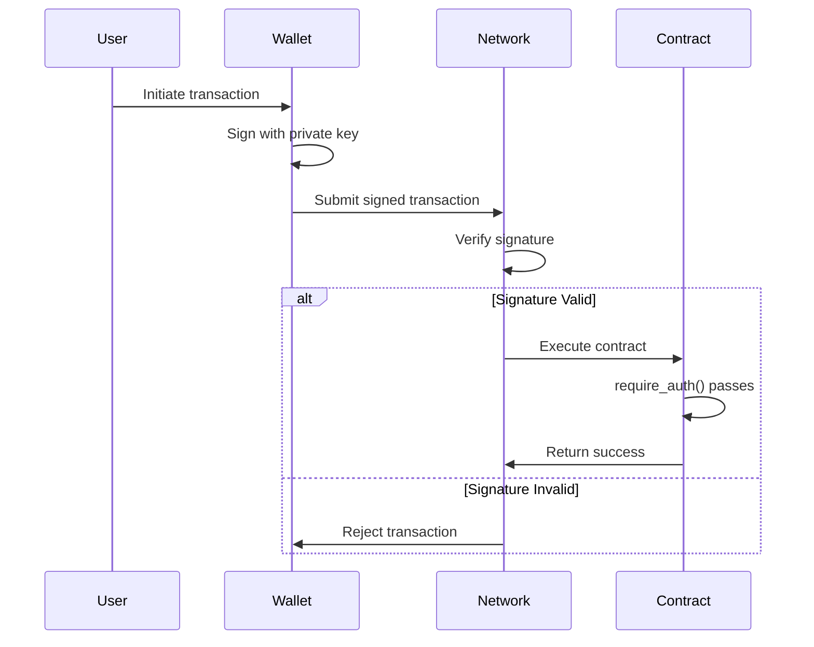
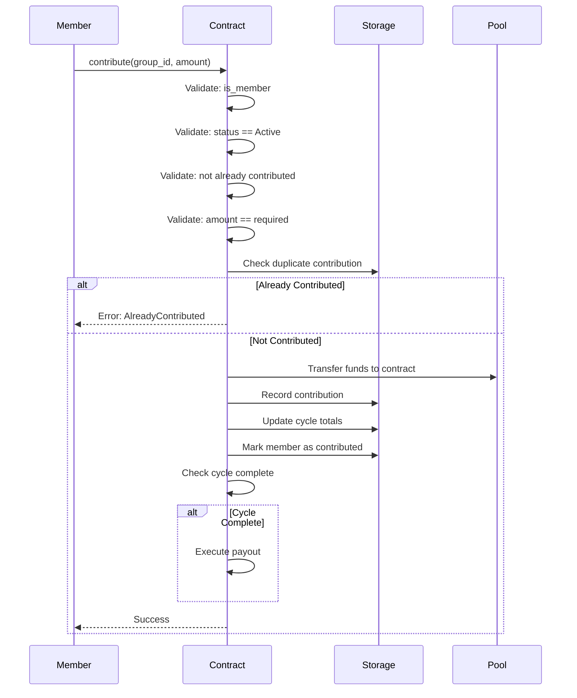
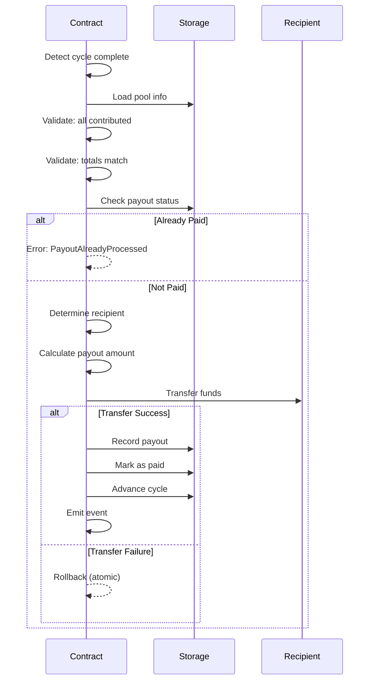

# Stellar-Save Security and Threat Model

## Table of Contents
1. [Overview](#overview)
2. [Security Architecture](#security-architecture)
3. [Threat Analysis](#threat-analysis)
4. [Mitigation Mechanisms](#mitigation-mechanisms)
5. [Fund Protection](#fund-protection)
6. [Emergency Procedures](#emergency-procedures)
7. [Security Best Practices](#security-best-practices)
8. [Audit Recommendations](#audit-recommendations)

---

## Overview

This document provides a comprehensive security analysis of the Stellar-Save smart contract, identifying potential threats and documenting implemented mitigation mechanisms. The analysis is based on the current contract implementation (v0.1.0) and focuses on realistic attack vectors relevant to rotational savings groups (ROSCAs) on the Stellar blockchain.

### Scope

**In Scope:**
- Smart contract security vulnerabilities
- Access control mechanisms
- Fund safety during contributions and payouts
- State integrity and consistency
- Input validation and error handling

**Out of Scope:**
- Frontend application security
- Wallet security
- Network-level attacks on Stellar
- Social engineering attacks on users

### Trust Model

**Trust Assumptions:**
- Stellar network consensus is secure
- Soroban runtime environment is secure
- Cryptographic primitives are sound
- Members act rationally (economic incentives)

**No Trust Required:**
- No trusted coordinator or admin for group operations
- No oracle dependencies
- No off-chain data sources
- No multi-signature requirements

---

## Security Architecture

### Defense-in-Depth Layers



### Security Principles

1. **Fail-Safe Defaults**: Operations fail closed on error
2. **Least Privilege**: Minimal permissions for each operation
3. **Defense in Depth**: Multiple layers of validation
4. **Explicit Error Handling**: All errors explicitly defined
5. **Immutable Records**: Historical data cannot be modified
6. **Deterministic Execution**: No randomness or external dependencies


---

## Threat Analysis

### T1: Reentrancy Attacks

**Description:**
Attacker attempts to recursively call contract functions before state updates complete, potentially draining funds or corrupting state.

**Risk Level:** ⚠️ LOW

**Applicability to Stellar-Save:**
Soroban's execution model prevents reentrancy by design. Contract calls are atomic and cannot be interrupted.

**Implemented Mitigations:**
1. **Soroban Runtime Protection**: No recursive calls allowed during execution
2. **State-Before-Transfer Pattern**: State updates occur before any external calls
3. **Atomic Transactions**: All operations complete or fail atomically

**Code Evidence:**
```rust
// State updated before any external operations
group.current_cycle += 1;
env.storage().persistent().set(&group_key, &group);

// Then emit events (no state changes after this)
EventEmitter::emit_payout_executed(...);
```

**Residual Risk:** None - prevented by Soroban architecture

---

### T2: Front-Running Attacks

**Description:**
Attacker observes pending transactions and submits their own transaction with higher fees to execute first, gaining unfair advantage.

**Risk Level:** ⚠️ LOW

**Applicability to Stellar-Save:**
Limited impact due to deterministic payout order and fixed contribution amounts.

**Attack Scenarios:**
1. **Join Order Manipulation**: Attacker tries to join before others to get earlier payout
2. **Contribution Racing**: Attacker tries to contribute first in a cycle

**Implemented Mitigations:**
1. **Deterministic Payout Order**: Based on join order, not contribution order
2. **Fixed Contribution Amounts**: No advantage to contributing first
3. **No Price Discovery**: No market mechanisms to exploit
4. **Sequential Processing**: Stellar's sequence numbers prevent transaction reordering

**Code Evidence:**
```rust
// Payout order determined by join order (immutable)
let recipient_index = cycle as usize;
let recipient = members.get(recipient_index).unwrap();

// Fixed contribution amount (no bidding)
if amount != group.contribution_amount {
    return Err(StellarSaveError::InvalidAmount);
}
```

**Residual Risk:** Minimal - limited economic incentive

---

### T3: Replay Attacks

**Description:**
Attacker captures and resubmits valid transactions to execute them multiple times.

**Risk Level:** ✅ NONE

**Applicability to Stellar-Save:**
Prevented by Stellar's built-in replay protection.

**Implemented Mitigations:**
1. **Stellar Sequence Numbers**: Each transaction has unique, incrementing sequence number
2. **Transaction Hashing**: Each transaction has unique hash
3. **Duplicate Contribution Check**: Contract-level duplicate prevention

**Code Evidence:**
```rust
// Check if member already contributed this cycle
let contrib_status_key = StorageKeyBuilder::member_contribution_status(group_id, member.clone());
let already_contributed: bool = env.storage().persistent().get(&contrib_status_key).unwrap_or(false);
if already_contributed {
    return Err(StellarSaveError::AlreadyContributed);
}
```

**Residual Risk:** None - multiple layers of protection

---

### T4: Unauthorized Access

**Description:**
Attacker attempts to execute privileged operations without proper authorization.

**Risk Level:** ⚠️ LOW

**Attack Scenarios:**
1. **Unauthorized Group Updates**: Non-creator tries to modify group parameters
2. **Unauthorized Group Deletion**: Non-creator tries to delete group
3. **Unauthorized Configuration Changes**: Non-admin tries to update global config

**Implemented Mitigations:**
1. **Explicit Authorization Checks**: `require_auth()` on all privileged operations
2. **Creator Verification**: Only creator can modify their groups
3. **Admin-Only Operations**: Global config requires admin authorization

**Code Evidence:**
```rust
// Group creation - creator must authorize
creator.require_auth();

// Group update - creator must authorize
group.creator.require_auth();

// Group deletion - creator must authorize
group.creator.require_auth();

// Config update - admin must authorize
current_config.admin.require_auth();
```

**Authorization Matrix:**

| Operation | Required Authorization | Enforced |
|-----------|----------------------|----------|
| create_group | Creator signature | ✅ Yes |
| update_group | Creator signature | ✅ Yes |
| delete_group | Creator signature | ✅ Yes |
| join_group | Member signature | ⚠️ Implicit |
| contribute | Member signature | ⚠️ Implicit |
| update_config | Admin signature | ✅ Yes |

**Residual Risk:** Low - comprehensive authorization checks

---

### T5: Oracle Manipulation

**Description:**
Attacker manipulates external data sources (oracles) to corrupt contract state or steal funds.

**Risk Level:** ✅ NONE

**Applicability to Stellar-Save:**
Not applicable - contract has no oracle dependencies.

**Design Characteristics:**
1. **No External Data**: All data is on-chain
2. **No Price Feeds**: Fixed contribution amounts
3. **No Time Oracles**: Uses Stellar ledger timestamp
4. **Deterministic Logic**: All calculations are internal

**Residual Risk:** None - no oracle dependencies

---

### T6: Denial of Service (DoS)

**Description:**
Attacker prevents legitimate users from interacting with the contract.

**Risk Level:** ⚠️ MEDIUM

**Attack Scenarios:**

#### T6.1: Gas Exhaustion
**Description:** Attacker creates groups with maximum members to exhaust gas limits.

**Mitigation:**
- Pagination in `list_groups()` with 50-item cap
- Direct key lookups (O(1) operations)
- No unbounded loops

**Code Evidence:**
```rust
let page_limit = if limit > 50 { 50 } else { limit }; // Safety cap for gas
```

#### T6.2: Storage Bloat
**Description:** Attacker creates many groups to bloat storage.

**Mitigation:**
- Storage costs paid by creator
- Economic disincentive to spam
- No free group creation

**Residual Risk:** Low - economic barriers prevent abuse

#### T6.3: Group Blocking
**Description:** Malicious member refuses to contribute, blocking cycle completion.

**Current State:** ⚠️ Vulnerable - no timeout mechanism

**Impact:** Group cannot progress if one member doesn't contribute

**Mitigation Status:** Not implemented

**Recommended Mitigation:**
- Implement contribution deadlines
- Add member removal mechanism
- Add penalty for non-contribution

**Residual Risk:** Medium - requires future enhancement

---

### T7: Integer Overflow/Underflow

**Description:**
Arithmetic operations exceed type bounds, causing unexpected behavior or fund loss.

**Risk Level:** ⚠️ LOW

**Vulnerable Operations:**
1. Group ID generation
2. Pool amount calculation
3. Member count tracking
4. Cycle advancement

**Implemented Mitigations:**
1. **Checked Arithmetic**: All critical operations use `checked_*()` methods
2. **Explicit Error Handling**: Overflow returns error instead of wrapping
3. **Type Safety**: Rust's type system prevents many overflow scenarios

**Code Evidence:**
```rust
// Group ID generation with overflow protection
let next_id = current_id.checked_add(1)
    .ok_or(StellarSaveError::Overflow)?;

// Pool calculation with overflow protection
let pool_amount = contribution_amount
    .checked_mul(member_count as i128)
    .ok_or(StellarSaveError::InternalError)?;
```

**Protected Operations:**
- ✅ Group ID increment
- ✅ Pool amount calculation
- ⚠️ Member count increment (unchecked but bounded by max_members)
- ⚠️ Cycle increment (unchecked but bounded by max_members)

**Residual Risk:** Very Low - critical paths protected

---

### T8: State Desynchronization

**Description:**
Contract state becomes inconsistent due to partial updates or race conditions.

**Risk Level:** ⚠️ LOW

**Potential Scenarios:**
1. Member count doesn't match member list length
2. Contribution totals don't match individual contributions
3. Payout status inconsistent with payout records

**Implemented Mitigations:**
1. **Atomic Updates**: All related state updated together
2. **Validation Before Write**: State validated before persistence
3. **Immutable Records**: Historical records cannot be modified
4. **Event Logging**: All state changes emit events for verification

**Code Evidence:**
```rust
// Atomic update of related state
group.member_count += 1;
members.push_back(member.clone());
env.storage().persistent().set(&group_key, &group);
env.storage().persistent().set(&members_key, &members);
```

**Invariant Checks:**
```rust
// Group validation
pub fn validate(&self) -> bool {
    self.contribution_amount > 0
        && self.cycle_duration > 0
        && self.max_members >= 2
        && self.min_members >= 2
        && self.min_members <= self.max_members
        && self.current_cycle <= self.max_members
}
```

**Residual Risk:** Low - comprehensive validation

---

### T9: Improper Validation

**Description:**
Insufficient input validation allows invalid state or malicious inputs.

**Risk Level:** ⚠️ LOW

**Validation Categories:**

#### Input Validation
**Implemented:**
- ✅ Contribution amount > 0
- ✅ Cycle duration > 0
- ✅ Max members >= 2
- ✅ Min members >= 2
- ✅ Min members <= max members
- ✅ Group exists before operations
- ✅ Member is part of group
- ✅ Group status allows operation

**Code Evidence:**
```rust
// Group creation validation
assert!(contribution_amount > 0, "contribution_amount must be greater than 0");
assert!(cycle_duration > 0, "cycle_duration must be greater than 0");
assert!(max_members >= 2, "max_members must be at least 2");
assert!(min_members >= 2, "min_members must be at least 2");
assert!(min_members <= max_members, "min_members must be <= max_members");

// Contribution validation
if amount != group.contribution_amount {
    return Err(StellarSaveError::InvalidAmount);
}
if status != GroupStatus::Active {
    return Err(StellarSaveError::InvalidState);
}
```

#### State Validation
**Implemented:**
- ✅ Group status transitions validated
- ✅ Cycle completion checked before payout
- ✅ Duplicate contribution prevented
- ✅ Member count bounds enforced

**Code Evidence:**
```rust
// State transition validation
pub fn can_transition_to(&self, new_status: GroupStatus) -> Result<(), StatusError> {
    match (self, new_status) {
        (GroupStatus::Pending, GroupStatus::Active) => Ok(()),
        (GroupStatus::Pending, GroupStatus::Cancelled) => Ok(()),
        // ... other valid transitions
        (GroupStatus::Completed, _) => Err(StatusError::AlreadyCompleted),
        (GroupStatus::Cancelled, _) => Err(StatusError::AlreadyCancelled),
        _ => Err(StatusError::InvalidTransition),
    }
}
```

**Residual Risk:** Low - comprehensive validation


---

## Mitigation Mechanisms

### Access Control Enforcement

**Mechanism:** Stellar's built-in signature verification via `require_auth()`

**Implementation:**
```rust
// Creator-only operations
creator.require_auth();  // Verifies transaction signed by creator

// Admin-only operations
admin.require_auth();    // Verifies transaction signed by admin
```

**Protected Operations:**
1. **Group Creation**: Creator must sign transaction
2. **Group Update**: Creator must sign transaction
3. **Group Deletion**: Creator must sign transaction
4. **Config Update**: Admin must sign transaction

**Verification Process:**
1. Transaction submitted with signature
2. Stellar network verifies signature matches public key
3. Contract calls `require_auth()` to enforce authorization
4. Operation proceeds only if signature valid

**Strengths:**
- Cryptographically secure (Ed25519 signatures)
- No password or secret storage in contract
- Replay protection via sequence numbers
- Network-level enforcement

**Limitations:**
- No role-based access control (RBAC)
- No delegation mechanisms
- Binary authorization (all or nothing)

---

### Input Validation

**Validation Layers:**

#### Layer 1: Type System
Rust's type system prevents many invalid inputs at compile time.

```rust
pub fn create_group(
    env: Env,
    creator: Address,        // Must be valid Address
    contribution_amount: i128, // Must be valid integer
    cycle_duration: u64,     // Must be valid unsigned integer
    max_members: u32,        // Must be valid unsigned integer
) -> Result<u64, StellarSaveError>
```

#### Layer 2: Assertion Checks
Runtime assertions validate business logic constraints.

```rust
assert!(contribution_amount > 0, "contribution_amount must be greater than 0");
assert!(cycle_duration > 0, "cycle_duration must be greater than 0");
assert!(max_members >= 2, "max_members must be at least 2");
```

#### Layer 3: Result-Based Validation
Explicit error returns for recoverable validation failures.

```rust
if !group.validate() {
    return Err(StellarSaveError::InvalidState);
}

if member_count >= max_members {
    return Err(StellarSaveError::GroupFull);
}
```

#### Layer 4: Global Configuration Validation
Contract-wide limits enforced via configuration.

```rust
if contribution_amount < config.min_contribution || 
   contribution_amount > config.max_contribution {
    return Err(StellarSaveError::InvalidState);
}
```

**Validation Coverage:**

| Input | Validation | Error Type |
|-------|-----------|------------|
| contribution_amount | > 0, within config bounds | InvalidAmount, InvalidState |
| cycle_duration | > 0, within config bounds | InvalidState |
| max_members | >= 2, within config bounds | InvalidState |
| min_members | >= 2, <= max_members | InvalidState |
| group_id | Exists in storage | GroupNotFound |
| member_address | Is group member | NotMember |
| group_status | Allows operation | InvalidState |

---

### Invariant Checks

**Critical Invariants:**

#### Group Invariants
```rust
impl Group {
    pub fn validate(&self) -> bool {
        self.contribution_amount > 0
            && self.cycle_duration > 0
            && self.max_members >= 2
            && self.min_members >= 2
            && self.min_members <= self.max_members
            && self.current_cycle <= self.max_members
    }
}
```

**Enforced At:**
- Group creation
- Group update
- Before state persistence

#### Contribution Invariants
```rust
// Each member contributes exactly once per cycle
let already_contributed = check_contribution_status(group_id, cycle, member);
if already_contributed {
    return Err(StellarSaveError::AlreadyContributed);
}

// Contribution amount must match group requirement
if amount != group.contribution_amount {
    return Err(StellarSaveError::InvalidAmount);
}
```

#### Payout Invariants
```rust
// Payout only when cycle complete
if contributors_count < member_count {
    return Err(StellarSaveError::CycleNotComplete);
}

// Total contributions must match expected pool
if current_contributions != total_pool_amount {
    return Err(StellarSaveError::InvalidAmount);
}

// No double payout
if already_paid {
    return Err(StellarSaveError::PayoutAlreadyProcessed);
}
```

#### State Transition Invariants
```rust
// Terminal states cannot transition
if status.is_terminal() {
    return Err(StatusError::AlreadyCompleted); // or AlreadyCancelled
}

// Only valid transitions allowed
status.can_transition_to(new_status)?;
```

---

### Overflow Protection

**Protected Operations:**

#### Group ID Generation
```rust
let next_id = current_id.checked_add(1)
    .ok_or(StellarSaveError::Overflow)?;
```

**Protection:** Prevents ID wraparound  
**Error Handling:** Returns explicit Overflow error  
**Maximum Value:** 2^64 - 1 groups (practically unlimited)

#### Pool Calculation
```rust
let pool_amount = contribution_amount
    .checked_mul(member_count as i128)
    .ok_or(StellarSaveError::InternalError)?;
```

**Protection:** Prevents arithmetic overflow  
**Error Handling:** Returns InternalError  
**Maximum Value:** 2^127 - 1 stroops (practically unlimited)

#### Contribution Aggregation
```rust
let new_total = current_total.checked_add(contribution_amount)?;
```

**Protection:** Prevents total overflow  
**Error Handling:** Propagates error  
**Maximum Value:** 2^127 - 1 stroops

**Unchecked Operations:**

⚠️ **Member Count Increment**
```rust
group.member_count += 1;
```
**Risk:** Low - bounded by max_members validation  
**Mitigation:** Pre-check ensures member_count < max_members

⚠️ **Cycle Increment**
```rust
group.current_cycle += 1;
```
**Risk:** Low - bounded by max_members  
**Mitigation:** Group completes when current_cycle >= max_members

---

### Signature Verification

**Mechanism:** Stellar's Ed25519 signature scheme

**Verification Flow:**


**Properties:**
- **Unforgeable**: Cannot create valid signature without private key
- **Non-repudiable**: Signer cannot deny signing
- **Tamper-evident**: Any modification invalidates signature
- **Replay-protected**: Sequence numbers prevent reuse

**Contract Usage:**
```rust
// Explicit authorization check
creator.require_auth();

// Stellar runtime verifies:
// 1. Transaction signed by creator's private key
// 2. Signature matches creator's public key
// 3. Transaction not replayed (sequence number)
```

---

### Deterministic Execution

**Guarantees:**

#### No Randomness
- No random number generation
- No probabilistic algorithms
- Payout order determined by join order

#### No External Dependencies
- No oracle calls
- No off-chain data
- No network requests

#### Deterministic State Transitions
```rust
// State transitions are fully deterministic
match (current_status, action) {
    (Pending, Activate) => Active,
    (Active, Complete) => Completed,
    // ... all transitions defined
}
```

#### Deterministic Calculations
```rust
// Pool calculation is deterministic
pool_amount = contribution_amount × member_count

// Payout recipient is deterministic
recipient = members[current_cycle]
```

**Benefits:**
- Predictable behavior
- Reproducible results
- No timing attacks
- No oracle manipulation

---

### Storage Integrity

**Protection Mechanisms:**

#### Immutable Records
```rust
// Contribution records are write-once
let key = StorageKeyBuilder::contribution_individual(group_id, cycle, address);
env.storage().persistent().set(&key, &contribution);
// Never modified after creation
```

#### Atomic Updates
```rust
// Related state updated together
group.member_count += 1;
members.push_back(member.clone());
env.storage().persistent().set(&group_key, &group);
env.storage().persistent().set(&members_key, &members);
```

#### Validation Before Persistence
```rust
// Validate before writing
if !group.validate() {
    return Err(StellarSaveError::InvalidState);
}
env.storage().persistent().set(&key, &group);
```

#### Key Namespacing
```rust
// Keys are namespaced to prevent collisions
pub enum StorageKey {
    Group(GroupKey),
    Member(MemberKey),
    Contribution(ContributionKey),
    Payout(PayoutKey),
    Counter(CounterKey),
}
```

**Storage Guarantees:**
- No key collisions
- No partial updates
- No orphaned data
- Consistent state


---

## Fund Protection

### Contribution Handling

**Security Flow:**



**Protection Mechanisms:**

#### 1. Duplicate Prevention
```rust
// Check if already contributed
let contrib_status_key = StorageKeyBuilder::member_contribution_status(group_id, member);
let already_contributed: bool = env.storage().persistent().get(&contrib_status_key).unwrap_or(false);
if already_contributed {
    return Err(StellarSaveError::AlreadyContributed);
}
```

**Prevents:** Double contribution in same cycle  
**Impact:** Protects member from accidental double payment

#### 2. Amount Validation
```rust
// Validate contribution amount
if amount != group.contribution_amount {
    return Err(StellarSaveError::InvalidAmount);
}
```

**Prevents:** Incorrect contribution amounts  
**Impact:** Ensures pool integrity

#### 3. Membership Verification
```rust
// Verify member belongs to group
if !is_member(env, group_id, &member) {
    return Err(StellarSaveError::NotMember);
}
```

**Prevents:** Non-members contributing  
**Impact:** Prevents unauthorized fund injection

#### 4. Status Check
```rust
// Verify group is active
if status != GroupStatus::Active {
    return Err(StellarSaveError::InvalidState);
}
```

**Prevents:** Contributions to inactive groups  
**Impact:** Protects funds from being locked

#### 5. Atomic Recording
```rust
// Record contribution atomically
env.storage().persistent().set(&contrib_key, &contribution);
env.storage().persistent().set(&total_key, &new_total);
env.storage().persistent().set(&count_key, &new_count);
env.storage().persistent().set(&status_key, &true);
```

**Prevents:** Partial state updates  
**Impact:** Ensures contribution is fully recorded or fails

**Fund Safety Guarantees:**
- ✅ No double contributions
- ✅ Correct amounts only
- ✅ Members only
- ✅ Active groups only
- ✅ Atomic recording

---

### Payout Execution

**Security Flow:**



**Protection Mechanisms:**

#### 1. Cycle Completion Validation
```rust
// Verify all members contributed
let pool_info = PoolCalculator::get_pool_info(env, group_id, cycle)?;
if !pool_info.is_cycle_complete {
    return Err(StellarSaveError::CycleNotComplete);
}
```

**Prevents:** Premature payout  
**Impact:** Ensures full pool collected

#### 2. Amount Verification
```rust
// Verify total matches expected
if pool_info.current_contributions != pool_info.total_pool_amount {
    return Err(StellarSaveError::InvalidAmount);
}
```

**Prevents:** Incorrect payout amounts  
**Impact:** Protects against calculation errors

#### 3. Double Payout Prevention
```rust
// Check if already paid
let status_key = StorageKeyBuilder::payout_status(group_id, cycle);
let already_paid: bool = env.storage().persistent().get(&status_key).unwrap_or(false);
if already_paid {
    return Err(StellarSaveError::PayoutAlreadyProcessed);
}
```

**Prevents:** Double payout to same recipient  
**Impact:** Protects pool funds

#### 4. Recipient Validation
```rust
// Verify recipient is valid member
let recipient_index = cycle as usize;
if recipient_index >= members.len() {
    return Err(StellarSaveError::InvalidRecipient);
}
let recipient = members.get(recipient_index).unwrap();
```

**Prevents:** Payout to invalid address  
**Impact:** Ensures funds go to legitimate member

#### 5. Atomic Execution
```rust
// All payout operations are atomic
transfer_funds(recipient, payout_amount)?;
env.storage().persistent().set(&payout_key, &payout_record);
env.storage().persistent().set(&status_key, &true);
group.current_cycle += 1;
env.storage().persistent().set(&group_key, &group);
```

**Prevents:** Partial payout execution  
**Impact:** Ensures payout fully completes or fails

**Fund Safety Guarantees:**
- ✅ No premature payouts
- ✅ Correct amounts only
- ✅ No double payouts
- ✅ Valid recipients only
- ✅ Atomic execution

---

### Settlement Finalization

**Completion Criteria:**
1. All members have contributed in all cycles
2. All members have received exactly one payout
3. Total distributed equals total contributed
4. Group status transitions to Completed

**Finalization Process:**

```rust
// After final payout
if group.current_cycle >= group.max_members {
    // Mark group as completed
    group.status = GroupStatus::Completed;
    group.is_active = false;
    
    // Persist final state
    env.storage().persistent().set(&group_key, &group);
    env.storage().persistent().set(&status_key, &GroupStatus::Completed);
    
    // Emit completion event
    EventEmitter::emit_group_completed(
        env,
        group.id,
        group.creator,
        group.max_members,
        total_distributed,
        env.ledger().timestamp()
    );
}
```

**Protection Mechanisms:**

#### 1. Completion Validation
```rust
// Verify all cycles completed
assert_eq!(group.current_cycle, group.max_members);

// Verify all payouts executed
for cycle in 0..group.max_members {
    let status_key = StorageKeyBuilder::payout_status(group_id, cycle);
    let paid: bool = env.storage().persistent().get(&status_key).unwrap_or(false);
    assert!(paid, "Cycle {} not paid", cycle);
}
```

#### 2. Terminal State Enforcement
```rust
// Completed groups cannot transition
if status == GroupStatus::Completed {
    return Err(StatusError::AlreadyCompleted);
}
```

**Prevents:** Further operations on completed groups  
**Impact:** Protects historical integrity

#### 3. Immutable History
```rust
// Contribution and payout records are immutable
// Once written, they cannot be modified
```

**Prevents:** Historical tampering  
**Impact:** Ensures audit trail integrity

**Settlement Guarantees:**
- ✅ All members paid exactly once
- ✅ Total in equals total out
- ✅ No further operations allowed
- ✅ Immutable historical record

---

### Double Execution Prevention

**Mechanisms:**

#### 1. Contribution Double Execution
```rust
// Member contribution status flag
MEMBER_CONTRIB_{group_id}_{address} → bool

// Check before contribution
if already_contributed {
    return Err(StellarSaveError::AlreadyContributed);
}

// Set after contribution
env.storage().persistent().set(&status_key, &true);
```

**Prevents:** Member contributing twice in same cycle

#### 2. Payout Double Execution
```rust
// Payout status flag
PAYOUT_STATUS_{group_id}_{cycle} → bool

// Check before payout
if already_paid {
    return Err(StellarSaveError::PayoutAlreadyProcessed);
}

// Set after payout
env.storage().persistent().set(&status_key, &true);
```

**Prevents:** Payout executing twice for same cycle

#### 3. State Transition Double Execution
```rust
// Terminal state check
if status.is_terminal() {
    return Err(StatusError::AlreadyCompleted);
}
```

**Prevents:** Transitioning from terminal states

#### 4. Transaction-Level Protection
- Stellar sequence numbers prevent transaction replay
- Each transaction has unique hash
- Network-level deduplication

**Protection Layers:**
1. Network-level (Stellar sequence numbers)
2. Contract-level (status flags)
3. Storage-level (immutable records)

---

### State Consistency

**Consistency Guarantees:**

#### 1. Atomic State Updates
All related state changes occur together or not at all.

```rust
// Example: Member join
group.member_count += 1;
members.push_back(member.clone());
env.storage().persistent().set(&group_key, &group);
env.storage().persistent().set(&members_key, &members);
// Both updates succeed or both fail
```

#### 2. Validation Before Persistence
State is validated before being written to storage.

```rust
if !group.validate() {
    return Err(StellarSaveError::InvalidState);
}
env.storage().persistent().set(&key, &group);
```

#### 3. Event Emission
All state changes emit events for external verification.

```rust
EventEmitter::emit_contribution_made(
    env,
    group_id,
    contributor,
    amount,
    cycle,
    cycle_total,
    timestamp
);
```

#### 4. Invariant Maintenance
Critical invariants are checked and maintained.

```rust
// Invariant: member_count <= max_members
assert!(group.member_count <= group.max_members);

// Invariant: current_cycle <= max_members
assert!(group.current_cycle <= group.max_members);

// Invariant: contribution total = expected pool
assert_eq!(cycle_total, expected_pool);
```

**Consistency Checks:**
- ✅ Member count matches member list length
- ✅ Contribution totals match individual contributions
- ✅ Payout status matches payout records
- ✅ Group status reflects actual state


---

## Emergency Procedures

### Admin Controls

**Current Implementation:**

#### Global Configuration Management
```rust
pub fn update_config(env: Env, new_config: ContractConfig) -> Result<(), StellarSaveError> {
    // Validate configuration
    if !new_config.validate() {
        return Err(StellarSaveError::InvalidState);
    }
    
    // Admin authorization required
    if let Some(current_config) = env.storage().persistent().get(&key) {
        current_config.admin.require_auth();
    } else {
        new_config.admin.require_auth();
    }
    
    // Update configuration
    env.storage().persistent().set(&key, &new_config);
    Ok(())
}
```

**Admin Capabilities:**
- ✅ Update global configuration limits
- ✅ Change admin address
- ❌ Cannot modify existing groups
- ❌ Cannot access group funds
- ❌ Cannot pause individual groups

**Configuration Parameters:**
```rust
pub struct ContractConfig {
    pub admin: Address,
    pub min_contribution: i128,
    pub max_contribution: i128,
    pub min_members: u32,
    pub max_members: u32,
    pub min_cycle_duration: u64,
    pub max_cycle_duration: u64,
}
```

**Limitations:**
- Configuration changes only affect new groups
- Existing groups are not impacted
- No emergency stop mechanism
- No fund recovery mechanism

---

### Threshold Updates

**Current Implementation:**

Configuration thresholds can be updated by admin:

```rust
// Example: Update contribution limits
let new_config = ContractConfig {
    admin: current_admin,
    min_contribution: 1_000_000,    // 0.1 XLM
    max_contribution: 1_000_000_000, // 100 XLM
    min_members: 2,
    max_members: 100,
    min_cycle_duration: 86400,      // 1 day
    max_cycle_duration: 31536000,   // 1 year
};

contract.update_config(new_config)?;
```

**Impact:**
- New groups must comply with new limits
- Existing groups unaffected
- No retroactive enforcement

**Use Cases:**
1. Adjust limits based on network conditions
2. Respond to economic changes
3. Prevent abuse patterns
4. Accommodate user feedback

**Safeguards:**
- Admin authorization required
- Configuration validation enforced
- Changes logged via events
- No impact on active groups

---

### Pausing Mechanisms

**Current Implementation:** ❌ Not Implemented

**Status:** No global or per-group pause mechanism exists.

**Implications:**
- Groups cannot be paused once active
- No emergency stop for compromised groups
- Members must complete cycles or forfeit

**Recommended Implementation:**

```rust
// Proposed pause mechanism
pub fn pause_group(env: Env, group_id: u64) -> Result<(), StellarSaveError> {
    let mut group = get_group(&env, group_id)?;
    
    // Only creator or admin can pause
    group.creator.require_auth();
    
    // Can only pause active groups
    if group.status != GroupStatus::Active {
        return Err(StellarSaveError::InvalidState);
    }
    
    // Transition to paused
    group.status = GroupStatus::Paused;
    env.storage().persistent().set(&group_key, &group);
    
    Ok(())
}

pub fn resume_group(env: Env, group_id: u64) -> Result<(), StellarSaveError> {
    let mut group = get_group(&env, group_id)?;
    
    // Only creator or admin can resume
    group.creator.require_auth();
    
    // Can only resume paused groups
    if group.status != GroupStatus::Paused {
        return Err(StellarSaveError::InvalidState);
    }
    
    // Transition back to active
    group.status = GroupStatus::Active;
    env.storage().persistent().set(&group_key, &group);
    
    Ok(())
}
```

**Benefits:**
- Emergency response capability
- Dispute resolution mechanism
- Protection against discovered vulnerabilities

**Risks:**
- Creator/admin abuse
- Indefinite fund locking
- Member disputes

---

### Safe Migration Strategies

**Current Implementation:** ❌ Not Implemented

**Status:** No contract upgrade or migration mechanism exists.

**Soroban Upgrade Capabilities:**

Soroban supports contract upgrades via:
1. **Contract Replacement**: Deploy new contract, migrate data
2. **Proxy Pattern**: Use proxy contract for upgradability
3. **Data Migration**: Export data, import to new contract

**Recommended Migration Strategy:**

#### Phase 1: Preparation
1. Deploy new contract version
2. Test thoroughly on testnet
3. Audit new contract
4. Prepare migration scripts

#### Phase 2: Announcement
1. Announce migration timeline
2. Notify all group creators
3. Provide migration documentation
4. Set cutoff date for new groups

#### Phase 3: Migration
1. Disable new group creation on old contract
2. Allow existing groups to complete
3. Provide data export tools
4. Migrate completed groups to new contract

#### Phase 4: Completion
1. Verify all active groups completed or migrated
2. Archive old contract data
3. Redirect users to new contract
4. Monitor for issues

**Data Migration Considerations:**
- Preserve contribution history
- Maintain payout records
- Keep member lists intact
- Ensure fund safety during migration

**Risks:**
- Data loss during migration
- Fund locking if migration fails
- User confusion
- Incomplete migration

**Mitigation:**
- Comprehensive testing
- Gradual rollout
- Rollback capability
- Clear communication

---

### Fund Recovery

**Current Implementation:** ❌ Not Implemented

**Status:** No mechanism to recover funds from abandoned or stuck groups.

**Scenarios Requiring Recovery:**

1. **Abandoned Groups**: Members stop participating
2. **Stuck Cycles**: One member refuses to contribute
3. **Lost Keys**: Creator loses access
4. **Contract Bugs**: Funds locked due to bug

**Recommended Recovery Mechanisms:**

#### 1. Timeout-Based Recovery
```rust
// Proposed timeout mechanism
pub fn claim_timeout_refund(env: Env, group_id: u64) -> Result<(), StellarSaveError> {
    let group = get_group(&env, group_id)?;
    let member = env.invoker();
    
    // Check if cycle has timed out
    let cycle_deadline = group.started_at + (group.cycle_duration * (group.current_cycle + 1) as u64);
    let current_time = env.ledger().timestamp();
    
    if current_time < cycle_deadline + TIMEOUT_GRACE_PERIOD {
        return Err(StellarSaveError::TimeoutNotReached);
    }
    
    // Refund member's contributions
    let refund_amount = calculate_member_contributions(&env, group_id, &member)?;
    transfer_funds(&member, refund_amount)?;
    
    Ok(())
}
```

#### 2. Majority Vote Cancellation
```rust
// Proposed voting mechanism
pub fn vote_cancel_group(env: Env, group_id: u64) -> Result<(), StellarSaveError> {
    let member = env.invoker();
    
    // Record vote
    record_cancellation_vote(&env, group_id, &member)?;
    
    // Check if majority reached
    let votes = get_cancellation_votes(&env, group_id)?;
    let member_count = get_member_count(&env, group_id)?;
    
    if votes > member_count / 2 {
        // Cancel group and refund all members
        cancel_and_refund_group(&env, group_id)?;
    }
    
    Ok(())
}
```

#### 3. Admin Emergency Withdrawal
```rust
// Proposed emergency mechanism (use with extreme caution)
pub fn emergency_refund(env: Env, group_id: u64) -> Result<(), StellarSaveError> {
    // Requires admin authorization
    let config = get_config(&env)?;
    config.admin.require_auth();
    
    // Only for stuck groups
    let group = get_group(&env, group_id)?;
    if group.status != GroupStatus::Paused {
        return Err(StellarSaveError::InvalidState);
    }
    
    // Refund all members proportionally
    refund_all_members(&env, group_id)?;
    
    // Mark group as cancelled
    group.status = GroupStatus::Cancelled;
    env.storage().persistent().set(&group_key, &group);
    
    Ok(())
}
```

**Safeguards:**
- Multi-signature requirements
- Time delays
- Member consent
- Transparent process
- Audit trail

---

## Security Best Practices

### Implemented Practices

#### 1. Explicit Error Handling
✅ **Implemented**

All errors are explicitly defined and handled:

```rust
#[contracterror]
pub enum StellarSaveError {
    GroupNotFound = 1001,
    GroupFull = 1002,
    InvalidState = 1003,
    AlreadyMember = 2001,
    NotMember = 2002,
    Unauthorized = 2003,
    InvalidAmount = 3001,
    AlreadyContributed = 3002,
    CycleNotComplete = 3003,
    PayoutFailed = 4001,
    PayoutAlreadyProcessed = 4002,
    InvalidRecipient = 4003,
    InternalError = 9001,
    DataCorruption = 9002,
    Overflow = 9003,
}
```

**Benefits:**
- Clear error messages
- Stable error codes
- Client-friendly error handling
- Debugging support

#### 2. Event Emission Discipline
✅ **Implemented**

All state changes emit events:

```rust
// Group creation
EventEmitter::emit_group_created(env, group_id, creator, ...);

// Member join
EventEmitter::emit_member_joined(env, group_id, member, ...);

// Contribution
EventEmitter::emit_contribution_made(env, group_id, contributor, ...);

// Payout
EventEmitter::emit_payout_executed(env, group_id, recipient, ...);

// Completion
EventEmitter::emit_group_completed(env, group_id, creator, ...);
```

**Benefits:**
- External monitoring
- Audit trail
- UI updates
- Analytics

#### 3. Minimal Trust Assumptions
✅ **Implemented**

Contract operates trustlessly:

- No trusted coordinator
- No oracle dependencies
- No admin control over groups
- No off-chain dependencies
- Deterministic execution

**Trust Required:**
- Stellar network security
- Soroban runtime integrity
- Cryptographic primitives

**No Trust Required:**
- Group creators (limited privileges)
- Contract admin (no group access)
- Other members (enforced by contract)
- External services (none used)

#### 4. Deterministic State Transitions
✅ **Implemented**

All state transitions are deterministic:

```rust
// State machine with defined transitions
pub fn can_transition_to(&self, new_status: GroupStatus) -> Result<(), StatusError> {
    match (self, new_status) {
        (GroupStatus::Pending, GroupStatus::Active) => Ok(()),
        (GroupStatus::Active, GroupStatus::Completed) => Ok(()),
        // ... all transitions explicitly defined
        _ => Err(StatusError::InvalidTransition),
    }
}
```

**Benefits:**
- Predictable behavior
- No race conditions
- Reproducible results
- Testable logic

#### 5. Input Validation
✅ **Implemented**

All inputs are validated:

```rust
// Type-level validation
pub fn create_group(
    env: Env,
    creator: Address,
    contribution_amount: i128,
    cycle_duration: u64,
    max_members: u32,
) -> Result<u64, StellarSaveError>

// Runtime validation
assert!(contribution_amount > 0);
assert!(cycle_duration > 0);
assert!(max_members >= 2);
```

#### 6. Fail-Safe Defaults
✅ **Implemented**

Operations fail closed on error:

```rust
// Default to false for safety
let already_contributed: bool = env.storage()
    .persistent()
    .get(&key)
    .unwrap_or(false);  // Safe default

// Default to 0 for safety
let cycle_total: i128 = env.storage()
    .persistent()
    .get(&key)
    .unwrap_or(0);  // Safe default
```

#### 7. Immutable History
✅ **Implemented**

Historical records are immutable:

```rust
// Contribution records are write-once
env.storage().persistent().set(&contrib_key, &contribution);
// Never modified

// Payout records are write-once
env.storage().persistent().set(&payout_key, &payout);
// Never modified
```

#### 8. Overflow Protection
✅ **Partially Implemented**

Critical operations use checked arithmetic:

```rust
// Protected
let next_id = current_id.checked_add(1)?;
let pool_amount = contribution_amount.checked_mul(member_count as i128)?;

// Unprotected (but bounded)
group.member_count += 1;  // Bounded by max_members
group.current_cycle += 1;  // Bounded by max_members
```


---

## Audit Recommendations

### High Priority Areas

#### 1. Contribution and Payout Logic
**Focus:** Fund flow and state transitions

**Specific Checks:**
- Verify no double contribution possible
- Verify no double payout possible
- Verify correct pool calculation
- Verify atomic state updates
- Test edge cases (1 member, max members)
- Verify refund logic (if implemented)

**Test Scenarios:**
```rust
// Test: Double contribution prevention
member.contribute(group_id);
assert_error!(member.contribute(group_id), AlreadyContributed);

// Test: Double payout prevention
execute_payout(group_id, cycle);
assert_error!(execute_payout(group_id, cycle), PayoutAlreadyProcessed);

// Test: Correct pool calculation
let pool = calculate_pool(contribution, members);
assert_eq!(pool, contribution * members);
```

#### 2. Access Control
**Focus:** Authorization and permission checks

**Specific Checks:**
- Verify creator-only operations enforced
- Verify admin-only operations enforced
- Verify member-only operations enforced
- Test unauthorized access attempts
- Verify signature verification

**Test Scenarios:**
```rust
// Test: Non-creator cannot update group
assert_error!(non_creator.update_group(group_id), Unauthorized);

// Test: Non-admin cannot update config
assert_error!(non_admin.update_config(config), Unauthorized);

// Test: Non-member cannot contribute
assert_error!(non_member.contribute(group_id), NotMember);
```

#### 3. State Machine Transitions
**Focus:** Group lifecycle and status changes

**Specific Checks:**
- Verify all valid transitions work
- Verify all invalid transitions fail
- Verify terminal states cannot transition
- Test concurrent state changes
- Verify state consistency

**Test Scenarios:**
```rust
// Test: Valid transitions
assert_ok!(group.transition(Pending -> Active));
assert_ok!(group.transition(Active -> Completed));

// Test: Invalid transitions
assert_error!(group.transition(Pending -> Completed), InvalidTransition);
assert_error!(group.transition(Completed -> Active), AlreadyCompleted);
```

#### 4. Integer Overflow/Underflow
**Focus:** Arithmetic operations

**Specific Checks:**
- Verify all critical arithmetic uses checked operations
- Test boundary conditions (max values)
- Verify overflow returns error (not panic)
- Test large member counts
- Test large contribution amounts

**Test Scenarios:**
```rust
// Test: Group ID overflow
for _ in 0..u64::MAX {
    create_group(...);
}
assert_error!(create_group(...), Overflow);

// Test: Pool calculation overflow
let huge_contribution = i128::MAX / 2;
let many_members = 1000;
assert_error!(calculate_pool(huge_contribution, many_members), InternalError);
```

#### 5. Storage Integrity
**Focus:** Data consistency and persistence

**Specific Checks:**
- Verify atomic updates
- Verify no orphaned data
- Verify key uniqueness
- Test storage limits
- Verify data recovery after failure

**Test Scenarios:**
```rust
// Test: Atomic member addition
add_member(group_id, member);
assert_eq!(group.member_count, members_list.len());

// Test: Contribution totals match
let total = get_cycle_total(group_id, cycle);
let sum = sum_individual_contributions(group_id, cycle);
assert_eq!(total, sum);
```

---

### Medium Priority Areas

#### 6. Input Validation
**Focus:** Parameter validation and bounds checking

**Specific Checks:**
- Test zero and negative values
- Test boundary values (min/max)
- Test invalid addresses
- Test non-existent group IDs
- Verify error messages are correct

#### 7. Event Emission
**Focus:** Event correctness and completeness

**Specific Checks:**
- Verify all state changes emit events
- Verify event data is accurate
- Test event ordering
- Verify events cannot be spoofed

#### 8. Gas Optimization
**Focus:** Computational efficiency

**Specific Checks:**
- Measure gas costs for common operations
- Identify expensive operations
- Test with maximum group size
- Verify pagination limits

---

### Low Priority Areas

#### 9. Error Messages
**Focus:** Error clarity and consistency

**Specific Checks:**
- Verify error codes are stable
- Verify error messages are helpful
- Test error propagation
- Verify no information leakage

#### 10. Code Quality
**Focus:** Maintainability and readability

**Specific Checks:**
- Review code documentation
- Check for dead code
- Verify naming consistency
- Review test coverage

---

### Specific Vulnerabilities to Test

#### V1: Contribution Race Condition
**Scenario:** Two members contribute simultaneously in the last slot

**Test:**
```rust
// Setup: Group with 4/5 contributions
// Action: Members 5 and 6 contribute simultaneously
// Expected: One succeeds, one fails with CycleNotComplete or AlreadyContributed
```

#### V2: Payout Recipient Manipulation
**Scenario:** Attacker tries to change payout recipient

**Test:**
```rust
// Setup: Cycle complete, ready for payout
// Action: Attacker modifies member list
// Expected: Payout goes to original recipient or fails
```

#### V3: Group Deletion with Funds
**Scenario:** Creator tries to delete group with contributions

**Test:**
```rust
// Setup: Group with contributions
// Action: Creator calls delete_group
// Expected: Fails with InvalidState
```

#### V4: State Desynchronization
**Scenario:** Member count doesn't match member list

**Test:**
```rust
// Setup: Manually corrupt state
// Action: Attempt any operation
// Expected: Validation fails or state auto-corrects
```

#### V5: Cycle Completion Edge Case
**Scenario:** Cycle completes with incorrect total

**Test:**
```rust
// Setup: Manually set incorrect cycle total
// Action: Attempt payout
// Expected: Fails with InvalidAmount
```

---

### Testing Methodology

#### Unit Tests
**Coverage:** Individual functions and methods

**Focus:**
- Input validation
- Error handling
- Edge cases
- Boundary conditions

**Example:**
```rust
#[test]
fn test_group_creation_invalid_amount() {
    let env = Env::default();
    let creator = Address::generate(&env);
    
    let result = create_group(&env, creator, 0, 3600, 5);
    assert_eq!(result, Err(StellarSaveError::InvalidAmount));
}
```

#### Integration Tests
**Coverage:** Multi-function workflows

**Focus:**
- Complete group lifecycle
- Member interactions
- Fund flow
- State transitions

**Example:**
```rust
#[test]
fn test_complete_group_lifecycle() {
    // Create group
    let group_id = create_group(...);
    
    // Members join
    for member in members {
        join_group(group_id, member);
    }
    
    // Activate group
    activate_group(group_id);
    
    // Complete all cycles
    for cycle in 0..member_count {
        // All members contribute
        for member in members {
            contribute(group_id, member);
        }
        // Verify payout
        verify_payout(group_id, cycle);
    }
    
    // Verify completion
    assert_eq!(group.status, GroupStatus::Completed);
}
```

#### Property-Based Tests
**Coverage:** Invariant verification

**Focus:**
- State invariants
- Mathematical properties
- Consistency checks

**Example:**
```rust
#[test]
fn property_total_in_equals_total_out() {
    // For any completed group:
    let total_contributions = sum_all_contributions(group_id);
    let total_payouts = sum_all_payouts(group_id);
    assert_eq!(total_contributions, total_payouts);
}
```

#### Fuzz Testing
**Coverage:** Unexpected inputs

**Focus:**
- Random inputs
- Edge cases
- Crash detection
- Invariant violations

---

### Security Checklist

**Access Control:**
- [ ] Creator authorization enforced on group operations
- [ ] Admin authorization enforced on config operations
- [ ] Member verification enforced on contributions
- [ ] No privilege escalation possible

**Fund Safety:**
- [ ] No double contributions possible
- [ ] No double payouts possible
- [ ] Correct pool calculations
- [ ] Atomic fund transfers
- [ ] No fund locking scenarios

**State Integrity:**
- [ ] Atomic state updates
- [ ] Consistent state transitions
- [ ] Immutable historical records
- [ ] No orphaned data
- [ ] Proper error handling

**Input Validation:**
- [ ] All inputs validated
- [ ] Boundary conditions checked
- [ ] Type safety enforced
- [ ] Error messages clear

**Arithmetic Safety:**
- [ ] Critical operations use checked arithmetic
- [ ] Overflow returns error
- [ ] No underflow possible
- [ ] Correct type conversions

**Event Emission:**
- [ ] All state changes emit events
- [ ] Event data accurate
- [ ] Events cannot be spoofed
- [ ] Event ordering correct

**Code Quality:**
- [ ] No dead code
- [ ] Consistent naming
- [ ] Comprehensive documentation
- [ ] High test coverage

---

## Summary

### Security Strengths

1. **Strong Access Control**: Cryptographic signature verification
2. **Overflow Protection**: Checked arithmetic on critical paths
3. **Deterministic Execution**: No randomness or external dependencies
4. **Immutable History**: Contribution and payout records cannot be modified
5. **Explicit Error Handling**: All errors defined and handled
6. **Event Logging**: Complete audit trail
7. **State Validation**: Comprehensive invariant checks

### Known Limitations

1. **No Pause Mechanism**: Cannot stop groups in emergency
2. **No Timeout Handling**: Stuck groups cannot be resolved
3. **No Fund Recovery**: No mechanism for abandoned groups
4. **Limited Admin Powers**: Admin cannot intervene in groups
5. **No Upgrade Path**: No contract migration mechanism
6. **DoS Vulnerability**: Malicious member can block cycle

### Recommended Enhancements

1. **Implement Pause Mechanism**: Allow creator/admin to pause groups
2. **Add Timeout Logic**: Enable refunds after timeout period
3. **Add Voting Mechanism**: Allow members to vote on cancellation
4. **Implement Upgrade Path**: Plan for contract migration
5. **Add Member Removal**: Allow removal of non-contributing members
6. **Enhance Admin Controls**: Add emergency intervention capabilities

### Risk Assessment

**Overall Risk Level:** ⚠️ LOW-MEDIUM

**Critical Risks:** None identified

**High Risks:** 
- DoS via non-contributing member (Medium impact, Medium likelihood)

**Medium Risks:**
- No emergency procedures (Low impact, Low likelihood)
- No fund recovery mechanism (Low impact, Low likelihood)

**Low Risks:**
- Front-running (Minimal impact, Low likelihood)
- Unauthorized access (Prevented by design)

### Conclusion

The Stellar-Save smart contract demonstrates strong security fundamentals with comprehensive access control, overflow protection, and state validation. The primary security concern is the lack of emergency procedures and timeout mechanisms, which could lead to funds being locked in stuck groups. These limitations should be addressed in future versions.

The contract is suitable for production use with the understanding that:
1. Groups may become stuck if members don't contribute
2. No emergency stop mechanism exists
3. Contract upgrades require careful migration planning

External audit is recommended before mainnet deployment, with focus on fund flow, state transitions, and edge cases.

---

**Document Version:** 1.0  
**Last Updated:** 2024  
**Contract Version:** 0.1.0  
**Soroban SDK:** 23.0.3

---

## References

- [Soroban Security Best Practices](https://soroban.stellar.org/docs/learn/security)
- [Stellar Security Guide](https://developers.stellar.org/docs/learn/security)
- [Contract Implementation](../contracts/stellar-save/src/)
- [Architecture Documentation](./architecture.md)
- [Storage Layout](./storage-layout.md)
- [Pool Calculations](../POOL_CALCULATION.md)
